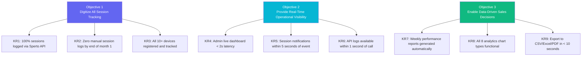
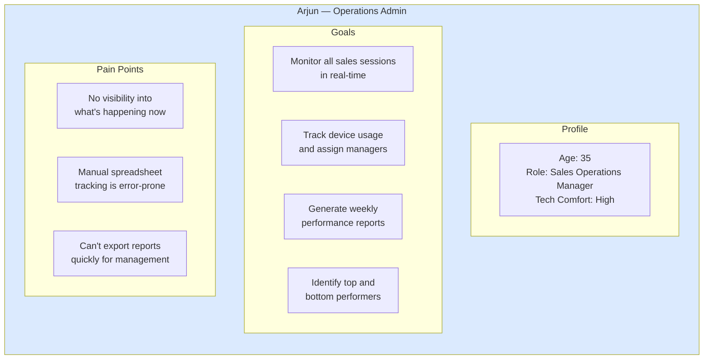
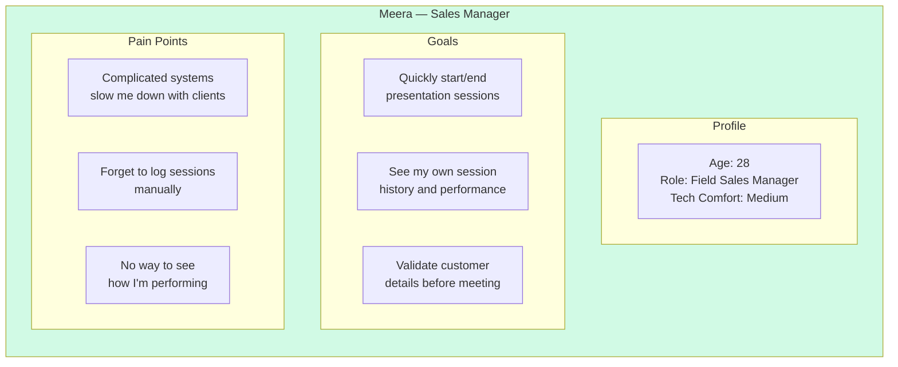
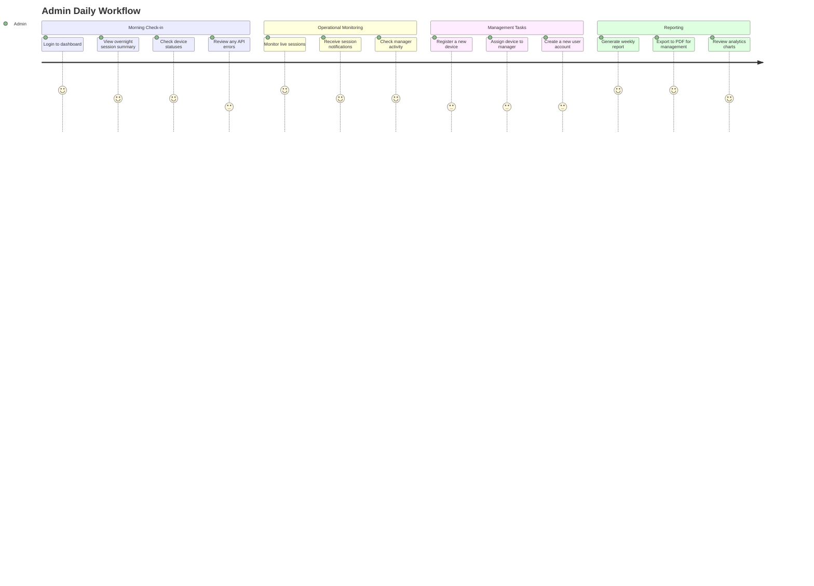
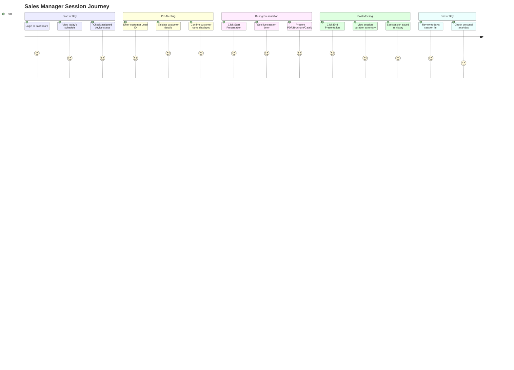
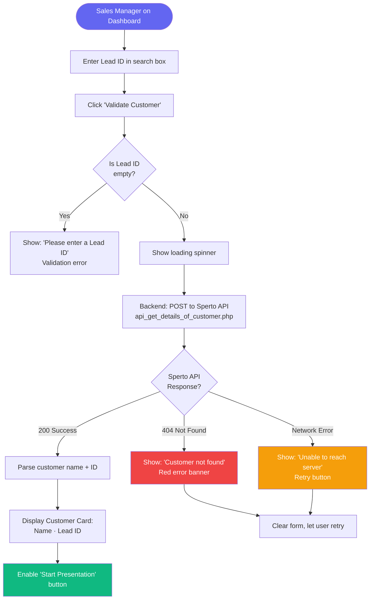
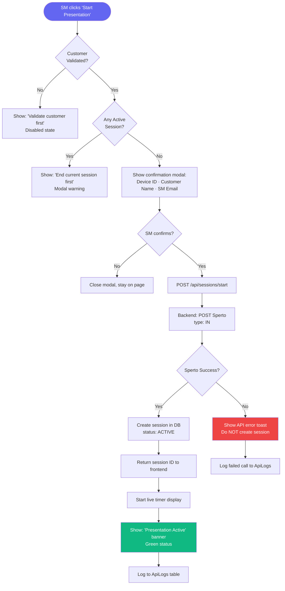
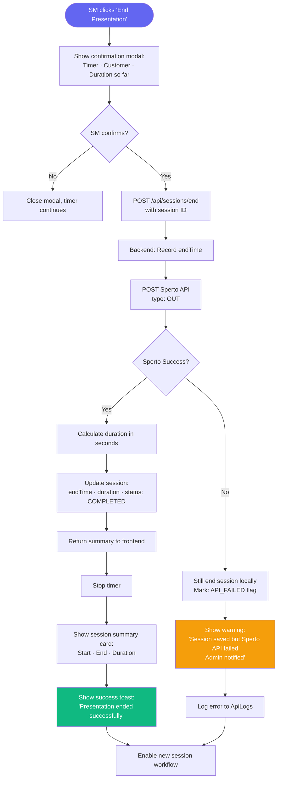
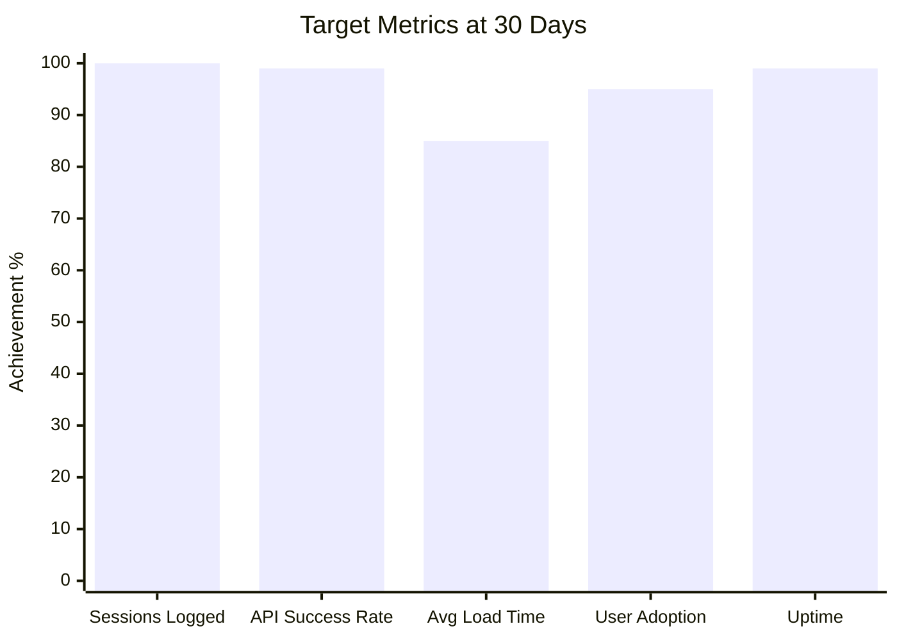

# PRD — Product Requirements Document
## Sperto Dashboard & API Integration System

> **Document Version**: 1.0.0 
> **Date**: June 30, 2026 
> **Product Owner**: Gautam 
> **Status**: Draft → Pending Approval 
> **Classification**: Internal · Confidential

---

## Table of Contents

1. [Executive Summary](#1-executive-summary)
2. [Product Vision](#2-product-vision)
3. [Business Goals & Success Metrics](#3-business-goals--success-metrics)
4. [User Personas](#4-user-personas)
5. [User Journey Maps](#5-user-journey-maps)
6. [Functional Requirements](#6-functional-requirements)
7. [Non-Functional Requirements](#7-non-functional-requirements)
8. [Feature Specifications](#8-feature-specifications)
9. [Role & Permission Matrix](#9-role--permission-matrix)
10. [Out of Scope](#10-out-of-scope)
11. [Dependencies & Assumptions](#11-dependencies--assumptions)
12. [Success Metrics & KPIs](#12-success-metrics--kpis)

---

## 1. Executive Summary

The **Sperto Dashboard** is an enterprise SaaS web application designed to digitize and centralize the tracking of customer presentation sessions. Sales Managers use it to log sessions via the Sperto API in real-time, while Admins gain full operational visibility through analytics, device management, and performance dashboards.

### Problem Statement

Currently, presentation session tracking is manual, fragmented, and provides no real-time visibility. There is no way to:
- Know which sales manager is with which customer right now
- Measure session durations accurately
- Track device usage across the organization
- Generate performance reports automatically

### Solution

A centralized, API-connected dashboard that automates session recording, provides live monitoring, and generates insights — eliminating manual tracking entirely.

---

## 2. Product Vision

> **"Empower every sales interaction with data-driven clarity — from the moment a presentation starts to the insights that drive the next one."**

```mermaid
mindmap
 root((Sperto Dashboard\nProduct Vision))
 Real-Time Visibility
 Live session tracking
 Active device monitoring
 Instant notifications
 Data-Driven Insights
 Session analytics
 Manager performance
 Customer behavior
 Operational Efficiency
 Automated API logging
 One-click reports
 Zero manual entry
 Enterprise Grade
 Role-based access
 Audit trails
 Secure architecture
 Sales Excellence
 Customer history
 Best-performer data
 Session optimization
```

---

## 3. Business Goals & Success Metrics

### Business Goals

| # | Goal | Metric | Target |
|---|---|---|---|
| G1 | Eliminate manual session tracking | % sessions tracked via API | 100% |
| G2 | Provide real-time session visibility | Admin sees live sessions | < 2s refresh |
| G3 | Reduce reporting time | Report generation time | < 10 seconds |
| G4 | Improve manager accountability | Sessions logged per day | 100% logged |
| G5 | Enable device management | Device utilization rate tracked | All devices |

### OKR Framework



---

## 4. User Personas

### Persona 1: Admin — "Arjun"



### Persona 2: Sales Manager — "Meera"



---

## 5. User Journey Maps

### 5.1 Admin Daily Journey



### 5.2 Sales Manager Daily Journey



---

## 6. Functional Requirements

### FR-001: Authentication System

| ID | Requirement | Priority |
|---|---|---|
| FR-001-1 | System shall provide email + password login | Must Have |
| FR-001-2 | System shall issue JWT access token (15 min expiry) | Must Have |
| FR-001-3 | System shall issue refresh token (7 day expiry, httpOnly cookie) | Must Have |
| FR-001-4 | System shall auto-refresh access token on expiry | Must Have |
| FR-001-5 | System shall provide forgot password via email link | Should Have |
| FR-001-6 | System shall provide password reset via secure token | Should Have |
| FR-001-7 | System shall log out and revoke refresh token | Must Have |
| FR-001-8 | System shall redirect to login on session expiry | Must Have |

### FR-002: Role-Based Access Control

| ID | Requirement | Priority |
|---|---|---|
| FR-002-1 | System shall enforce ADMIN role cannot start sessions | Must Have |
| FR-002-2 | System shall enforce SALES_MANAGER cannot view other users' data | Must Have |
| FR-002-3 | System shall protect all /admin/** routes from SALES_MANAGER | Must Have |
| FR-002-4 | System shall show role-appropriate navigation | Must Have |

### FR-003: Sales Manager — Session Workflow

| ID | Requirement | Priority |
|---|---|---|
| FR-003-1 | SM shall enter a Customer Lead ID on the dashboard | Must Have |
| FR-003-2 | System shall validate customer via Sperto API and display name | Must Have |
| FR-003-3 | SM shall click "Start Presentation" to begin session | Must Have |
| FR-003-4 | System shall call `api_record_device_usage.php` with `type: "IN"` | Must Have |
| FR-003-5 | System shall display a live running session timer | Must Have |
| FR-003-6 | SM shall click "End Presentation" to close session | Must Have |
| FR-003-7 | System shall call `api_record_device_usage.php` with `type: "OUT"` | Must Have |
| FR-003-8 | System shall calculate and store session duration | Must Have |
| FR-003-9 | System shall save session with COMPLETED status | Must Have |

### FR-004: Admin Dashboard

| ID | Requirement | Priority |
|---|---|---|
| FR-004-1 | Admin shall see KPI cards: Total Sessions Today, Active Sessions, Devices Online, Total Customers, Total Sales Managers, Avg/Min/Max Session Duration | Must Have |
| FR-004-2 | Admin shall see live sessions table with auto-refresh (10s) | Must Have |
| FR-004-3 | Admin shall see Sessions Per Day chart (last 30 days) | Must Have |
| FR-004-4 | Admin shall see Sessions Per Hour heatmap | Should Have |
| FR-004-5 | Admin shall see recent activity feed | Should Have |

### FR-005: Session History

| ID | Requirement | Priority |
|---|---|---|
| FR-005-1 | Admin shall see paginated session history (all sessions) | Must Have |
| FR-005-2 | SM shall see only their own session history | Must Have |
| FR-005-3 | Table shall support sorting by any column | Should Have |
| FR-005-4 | Table shall support filtering by date, device, customer, SM, status | Should Have |
| FR-005-5 | Table shall support export to CSV / Excel / PDF | Must Have |
| FR-005-6 | Table shall support text search | Should Have |

### FR-006: Device Management

| ID | Requirement | Priority |
|---|---|---|
| FR-006-1 | Admin shall register a new device with ID and name | Must Have |
| FR-006-2 | Admin shall assign a device to a Sales Manager | Must Have |
| FR-006-3 | Admin shall view all devices with status (Online/Offline/Disabled) | Must Have |
| FR-006-4 | Admin shall disable a device | Should Have |
| FR-006-5 | System shall track last seen timestamp per device | Must Have |

### FR-007: Analytics

| ID | Requirement | Priority |
|---|---|---|
| FR-007-1 | System shall render Sessions Per Day (Area Chart) | Must Have |
| FR-007-2 | System shall render Sessions Per Hour (Bar Chart) | Must Have |
| FR-007-3 | System shall render Device Usage (Pie/Donut Chart) | Must Have |
| FR-007-4 | System shall render Manager Performance (Bar Chart) | Must Have |
| FR-007-5 | System shall render Customer Visits (Line Chart) | Should Have |
| FR-007-6 | System shall render Weekly Activity (Grouped Bar) | Should Have |
| FR-007-7 | All charts shall support date range filtering | Should Have |

### FR-008: API Logs

| ID | Requirement | Priority |
|---|---|---|
| FR-008-1 | System shall log every Sperto API call with payload + response | Must Have |
| FR-008-2 | Admin shall search and filter API logs | Should Have |
| FR-008-3 | Admin shall retry failed API calls | Nice to Have |
| FR-008-4 | System shall display execution time per call | Must Have |

### FR-009: Notifications

| ID | Requirement | Priority |
|---|---|---|
| FR-009-1 | System shall show toast for: Login Success, Session Started, Session Ended | Must Have |
| FR-009-2 | System shall show toast for: API Success, API Failure | Should Have |
| FR-009-3 | System shall show bell icon with unread count | Should Have |
| FR-009-4 | System shall show notification history panel | Should Have |

---

## 7. Non-Functional Requirements

### Performance Requirements

| Metric | Target |
|---|---|
| Page initial load | < 2 seconds (LCP) |
| API response time (P95) | < 500ms |
| Session start/end API call | < 2 seconds (incl. Sperto API) |
| Dashboard data refresh | < 1 second |
| Report generation (1000 rows) | < 10 seconds |
| Concurrent sessions supported | 50+ |

### Security Requirements

| Requirement | Implementation |
|---|---|
| Password hashing | bcrypt, 12 rounds |
| Token storage | httpOnly cookies (refresh), memory (access) |
| API auth | Bearer JWT on all protected routes |
| SQL injection | Prevented by Prisma parameterized queries |
| XSS | Input sanitization + Content-Security-Policy |
| CSRF | SameSite cookie + CSRF tokens |
| Rate limiting | 100 req/15 min per IP, 5 req/min on auth |
| HTTPS | TLS 1.2+ via Nginx |

### Accessibility Requirements

| Requirement | Standard |
|---|---|
| Color contrast | WCAG AA (4.5:1 minimum) |
| Keyboard navigation | All interactive elements reachable |
| Screen reader | ARIA labels on all form elements |
| Focus indicators | Visible focus rings |
| Error messages | Associated with form fields via aria-describedby |

---

## 8. Feature Specifications

### 8.1 Customer Validation Feature



### 8.2 Start Presentation Feature



### 8.3 End Presentation Feature



---

## 9. Role & Permission Matrix

```mermaid
graph TD
 subgraph Roles["User Roles"]
 ADMIN[" ADMIN"]
 SM[" SALES_MANAGER"]
 end

 subgraph Pages["Dashboard Pages"]
 P1["/ Admin Overview Dashboard"]
 P2["/ SM Personal Dashboard"]
 P3["/present — Start/End Session"]
 P4["/sessions — All Sessions"]
 P5["/sessions/mine — My Sessions"]
 P6["/sessions/live — Live View"]
 P7["/devices — Device Management"]
 P8["/customers — Customer List"]
 P9["/managers — Manager List"]
 P10["/analytics — Charts"]
 P11["/reports — Export"]
 P12["/logs — API Logs"]
 P13["/users — User Management"]
 P14["/settings — Profile"]
 end

 ADMIN -->| Access| P1
 ADMIN -->| No Access| P3
 ADMIN -->| Access| P4
 ADMIN -->| Access| P6
 ADMIN -->| Access| P7
 ADMIN -->| Access| P8
 ADMIN -->| Access| P9
 ADMIN -->| Access| P10
 ADMIN -->| Access| P11
 ADMIN -->| Access| P12
 ADMIN -->| Access| P13
 ADMIN -->| Access| P14

 SM -->| No Access| P1
 SM -->| Access| P2
 SM -->| Access| P3
 SM -->| No Access| P4
 SM -->| Own Only| P5
 SM -->| No Access| P6
 SM -->| No Access| P7
 SM -->| No Access| P8
 SM -->| No Access| P9
 SM -->| Own Only| P10
 SM -->| No Access| P11
 SM -->| No Access| P12
 SM -->| No Access| P13
 SM -->| Access| P14
```



### Permission Detail Table

| Feature | Admin | Sales Manager |
|---|---|---|
| View own sessions | | |
| View all sessions | | |
| Start session | | |
| End session | | |
| View live sessions | | |
| Register device | | |
| Assign device | | |
| View all devices | | |
| View all customers | | |
| Validate customer | | |
| View all managers | | |
| View own analytics | | |
| View all analytics | | |
| Export reports | | |
| View API logs | | |
| Manage users | | |
| Change own password | | |

---

## 10. Out of Scope

The following are explicitly **not included** in v1.0:

- Mobile native app (iOS / Android)
- Real-time collaborative session notes
- Video recording of presentations
- Integration with CRM systems (Salesforce, HubSpot)
- Multi-language / i18n support
- White-labeling for other companies
- SSO / SAML authentication
- Payment and billing system
- Customer self-service portal

---

## 11. Dependencies & Assumptions

### External Dependencies

| Dependency | Risk | Mitigation |
|---|---|---|
| Sperto API (`net4hgc.sperto.co.in`) | API may be rate-limited or unavailable | Retry logic, error logging, fallback state |
| PostgreSQL database | Data loss on server failure | Daily backups |
| Email provider (SMTP) | Email delivery failure | Retry queue, in-app fallback |

### Assumptions

1. The Sperto `api_key` will be provided before development begins
2. Each Sales Manager is pre-assigned to exactly one Device ID
3. Customer Lead IDs are pre-existing in the Sperto system
4. Admin creates Sales Manager accounts (no self-signup)
5. All presentation content (PDFs, brochures) is handled by external software on the device; we only track session timing
6. The system supports a minimum of 50 concurrent active sessions

---

## 12. Success Metrics & KPIs

### Product KPIs at 30 Days Post-Launch



| KPI | Target | Measurement Method |
|---|---|---|
| Sessions logged via API | 100% | Count sessions with API log entry |
| Sperto API success rate | ≥ 99% | ApiLogs table success rate |
| Average page load time | < 2 seconds | Lighthouse / Core Web Vitals |
| System uptime | 99.5% | Health endpoint monitoring |
| User adoption (all SMs active) | 100% by Week 2 | User last_active tracking |
| Report generation time | < 10 seconds | Timed in integration tests |
| Zero critical security vulnerabilities | 0 | Security scan results |

---

*Document maintained by Gautam · Review with Yogesh before development begins* 
*Version 1.0.0 · June 30, 2026*
