# SDLC Document — Sperto Dashboard & API Integration System

> **Document Version**: 1.0.0 
> **Date**: June 30, 2026 
> **Project**: Sperto Sales Presentation Tracking Dashboard 
> **Team**: Gautam (Frontend Lead) · Yogesh (Backend Lead) 
> **Classification**: Internal · Confidential

---

## Table of Contents

1. [Project Overview](#1-project-overview)
2. [SDLC Model Selection](#2-sdlc-model-selection)
3. [Phase 1 — Planning](#3-phase-1--planning)
4. [Phase 2 — Requirements Analysis](#4-phase-2--requirements-analysis)
5. [Phase 3 — System Design](#5-phase-3--system-design)
6. [Phase 4 — Architecture Design](#6-phase-4--architecture-design)
7. [Phase 5 — Implementation](#7-phase-5--implementation)
8. [Phase 6 — Testing & QA](#8-phase-6--testing--qa)
9. [Phase 7 — Deployment](#9-phase-7--deployment)
10. [Phase 8 — Maintenance](#10-phase-8--maintenance)
11. [Risk Register](#11-risk-register)
12. [Team & Responsibilities](#12-team--responsibilities)

---

## 1. Project Overview

The Sperto Dashboard is an **enterprise SaaS application** that enables Sales Managers to track customer presentation sessions in real time, while giving Admins complete visibility into device usage, customer interactions, and performance analytics. The system integrates with the Sperto external API to record session start/end events.

### Project Goals

| Goal | Success Metric |
|---|---|
| Real-time session tracking | < 1s latency on session start/end |
| Sperto API integration | 100% of sessions logged via API |
| Role-based access | Zero unauthorized page access in testing |
| Analytics dashboard | All 8 chart types rendered correctly |
| Production deployment | Zero-downtime Docker deployment |

---

## 2. SDLC Model Selection

**Selected Model**: Agile Scrum with CI/CD

**Justification**:
- Small team (2 engineers) benefits from rapid iteration
- Sperto API integration needs prototyping and validation early
- UI/UX requirements benefit from iterative feedback
- 4-week timeline suits 2-week sprint cadence

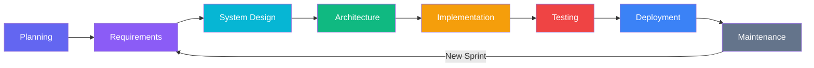

---

## 3. Phase 1 — Planning

### 3.1 Project Timeline (Gantt)

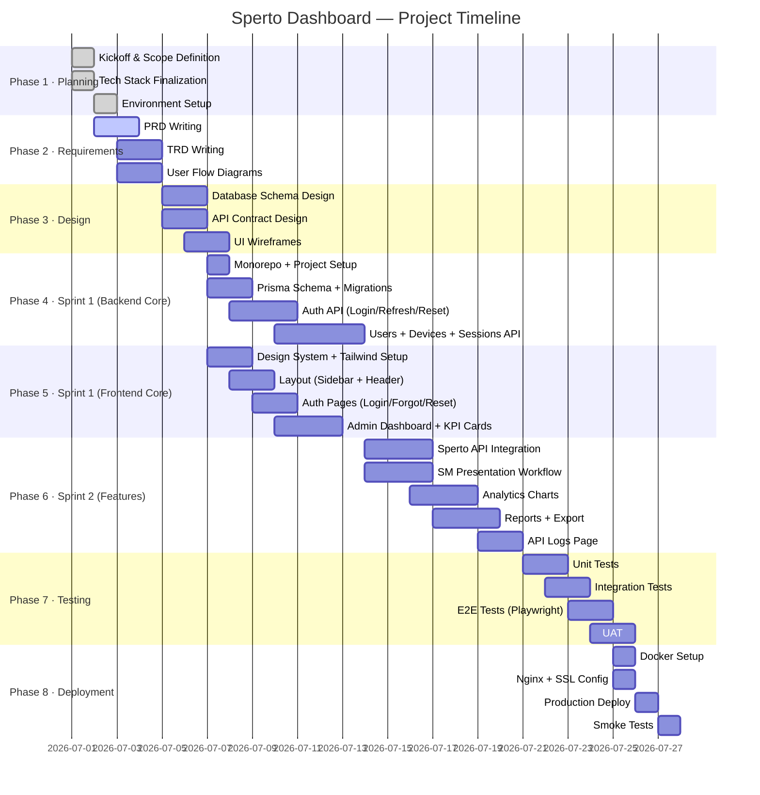

### 3.2 Sprint Plan

| Sprint | Duration | Gautam (Frontend) | Yogesh (Backend) |
|---|---|---|---|
| Sprint 0 | Day 1 | Monorepo setup, Tailwind, shadcn | Monorepo setup, Express, Prisma |
| Sprint 1 | Days 2–8 | Design system, Auth UI, Admin Dashboard | Auth API, DB schema, Sessions API |
| Sprint 2 | Days 9–14 | SM workflow, Charts, Reports UI | Sperto integration, Analytics API, Export |
| Sprint 3 | Days 15–18 | Notifications, Settings, Polish | Security hardening, Rate limiting |
| Sprint 4 | Days 19–21 | E2E tests, Bug fixes | Docker, Deployment, Smoke tests |

---

## 4. Phase 2 — Requirements Analysis

### 4.1 Stakeholder Map

```mermaid
mindmap
 root((Sperto Dashboard))
 Admin
 View All Sessions
 Manage Devices
 Manage Users
 View Analytics
 Export Reports
 View API Logs
 Sales Manager
 Login
 Validate Customer
 Start Presentation
 End Presentation
 View Own History
 System
 Sperto API
 PostgreSQL
 JWT Auth
 WebSockets/SSE
 External
 Sperto API Server
 Email Provider
 Cloud Host
```

### 4.2 Requirements Prioritization (MoSCoW)

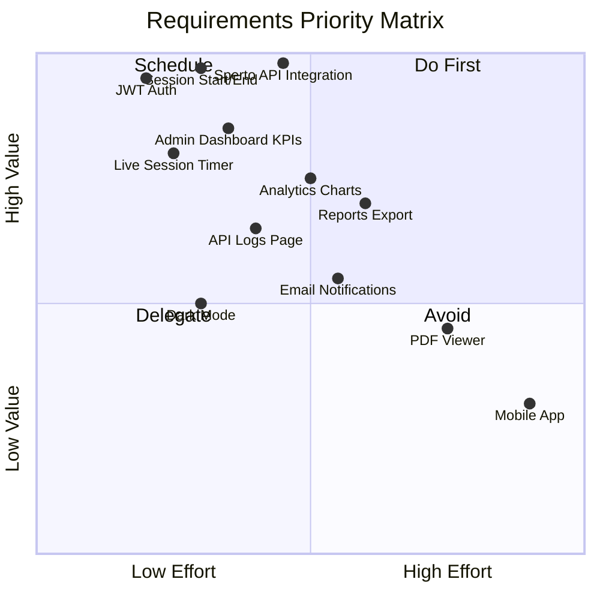

---

## 5. Phase 3 — System Design

### 5.1 High-Level System Architecture

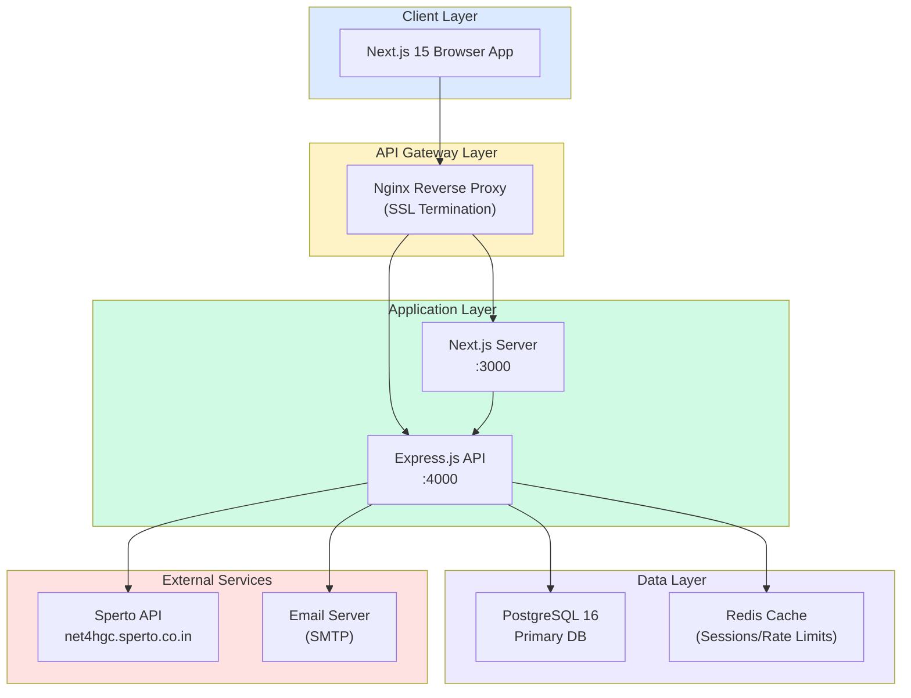

### 5.2 Database Entity Relationship Diagram

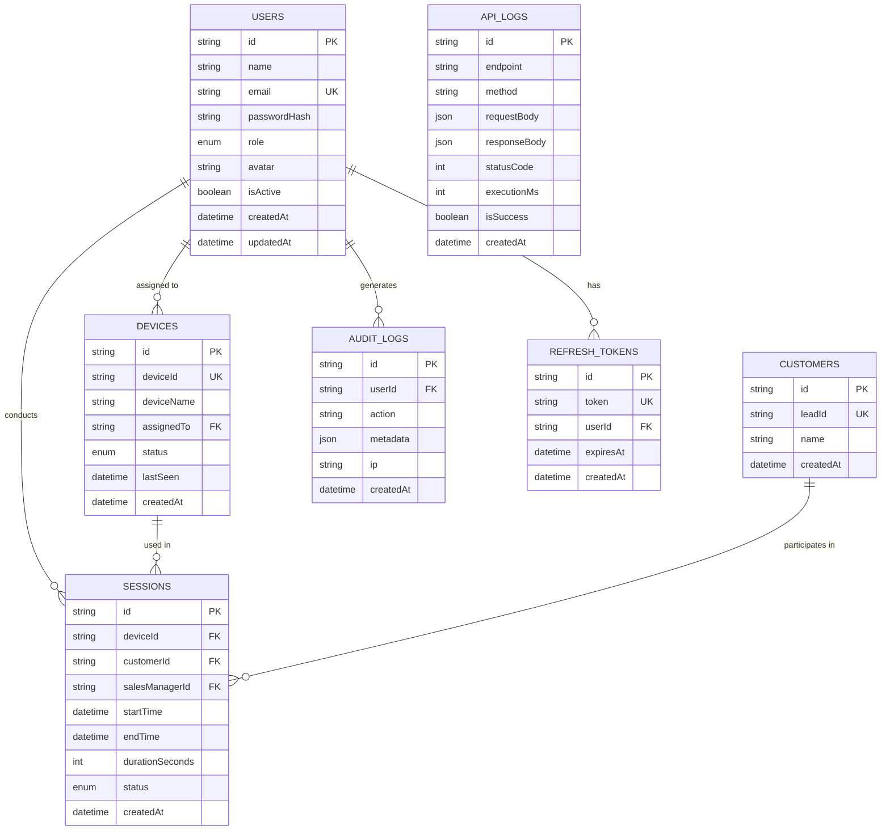

---

## 6. Phase 4 — Architecture Design

### 6.1 Frontend Architecture

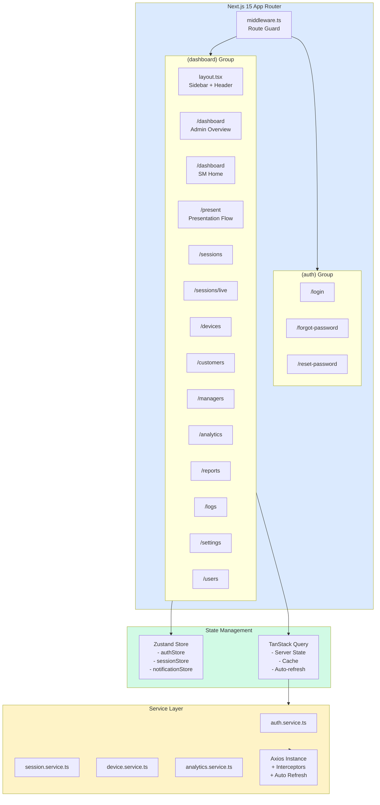

### 6.2 Backend Architecture

```mermaid
graph TD
 subgraph Express["Express.js API Server"]
 App[app.ts\nExpress Application]
 
 subgraph Middleware["Global Middleware Stack"]
 Helmet[helmet\nSecurity Headers]
 CORS[cors\nOrigin Control]
 RateLimit[rate-limit\n100 req/15min]
 APILogger[apiLogger\nLog all requests]
 AuthMW[auth.middleware\nJWT Verify]
 RBAC[rbac.middleware\nRole Guard]
 Validate[validate.middleware\nZod Schema]
 ErrorHandler[errorHandler\nGlobal Catch]
 end

 subgraph Modules["Feature Modules"]
 AuthMod["/auth\nauth.controller\nauth.service"]
 UsersMod["/users\nusers.controller\nusers.service"]
 DevicesMod["/devices\ndevices.controller\ndevices.service"]
 SessionsMod["/sessions\nsessions.controller\nsessions.service"]
 SpertoMod["/sperto\nsperto.service\nExternal API Proxy"]
 AnalyticsMod["/analytics\nanalytics.service"]
 ReportsMod["/reports\nreports.service"]
 LogsMod["/logs\nlogs.service"]
 end

 subgraph Lib["Shared Libraries"]
 Prisma[prisma.ts\nDB Client]
 JWT[jwt.ts\nToken Utils]
 Bcrypt[bcrypt.ts\nPassword Hash]
 Response[response.ts\nStandard Response]
 end
 end

 App --> Middleware
 Middleware --> Modules
 Modules --> Lib

 style Express fill:#d1fae5
 style Middleware fill:#fef3c7
 style Modules fill:#dbeafe
 style Lib fill:#ede9fe
```

---

## 7. Phase 5 — Implementation

### 7.1 Git Branching Strategy

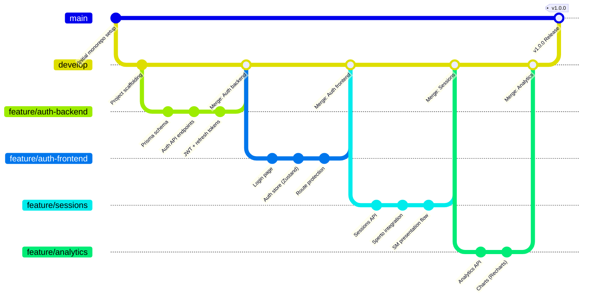

### 7.2 CI/CD Pipeline

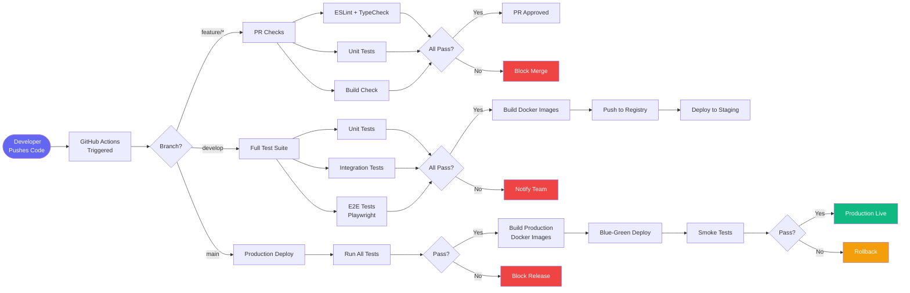

---

## 8. Phase 6 — Testing & QA

### 8.1 Testing Pyramid

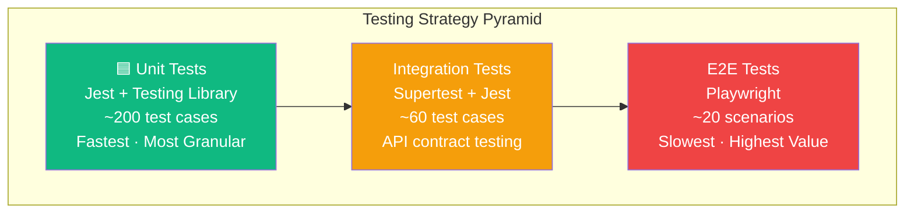

### 8.2 Test Coverage Plan

```mermaid
mindmap
 root((Test Coverage))
 Unit Tests
 Auth Service
 Login validation
 Password hashing
 Token generation
 Session Service
 Start session logic
 End session + duration
 Status transitions
 Sperto Service
 API call formation
 Error handling
 Retry logic
 React Components
 LoginForm rendering
 KPICard values
 SessionTimer counting
 Integration Tests
 POST /auth/login
 POST /sessions/start
 POST /sessions/end
 GET /analytics/overview
 POST /sperto/validate-customer
 E2E Tests
 Admin login flow
 SM complete session flow
 Admin dashboard loads
 Session history filters
 Report export
```

### 8.3 QA Gate Checklist

```mermaid
flowchart TD
 Start([🟢 Start QA]) --> A

 A[Code Review\nPassed] -->|| B[Unit Tests\n≥ 80% Coverage]
 A -->|| FAIL1[ Return to Dev]

 B -->|| C[Integration Tests\nAll Pass]
 B -->|| FAIL2[ Fix Tests]

 C -->|| D[E2E Tests\nAll Scenarios Pass]
 C -->|| FAIL3[ Fix Integration]

 D -->|| E[Performance Test\nLighthouse ≥ 85]
 D -->|| FAIL4[ Fix E2E]

 E -->|| F[Security Scan\nNo Critical Issues]
 E -->|| FAIL5[ Optimize]

 F -->|| G[UAT Sign-off]
 F -->|| FAIL6[ Patch Security]

 G -->|| PASS([ Ready for Deploy])
 G -->|| FAIL7[ Fix UAT Issues]

 style PASS fill:#10b981,color:#fff
 style Start fill:#6366f1,color:#fff
 style FAIL1 fill:#ef4444,color:#fff
 style FAIL2 fill:#ef4444,color:#fff
 style FAIL3 fill:#ef4444,color:#fff
 style FAIL4 fill:#ef4444,color:#fff
 style FAIL5 fill:#ef4444,color:#fff
 style FAIL6 fill:#ef4444,color:#fff
 style FAIL7 fill:#ef4444,color:#fff
```

---

## 9. Phase 7 — Deployment

### 9.1 Deployment Architecture

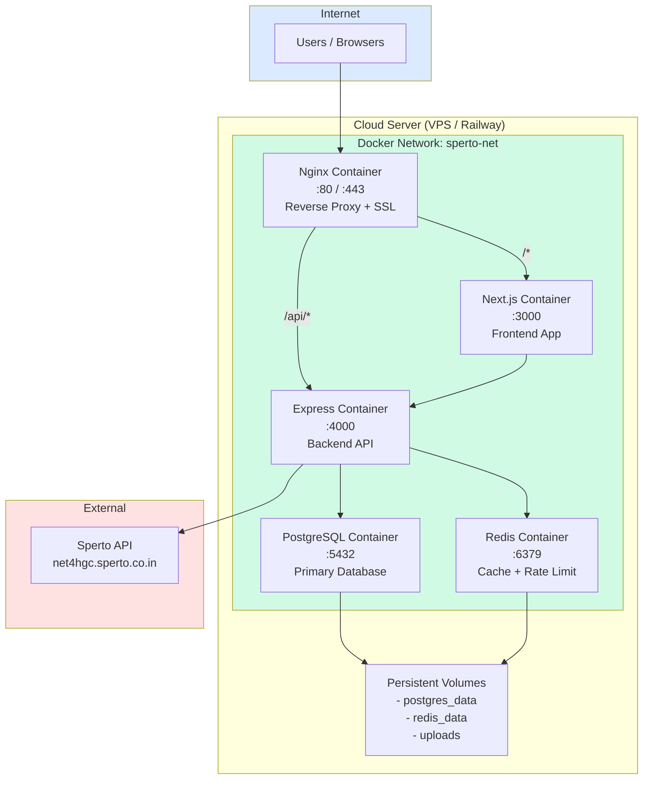

### 9.2 Release Process

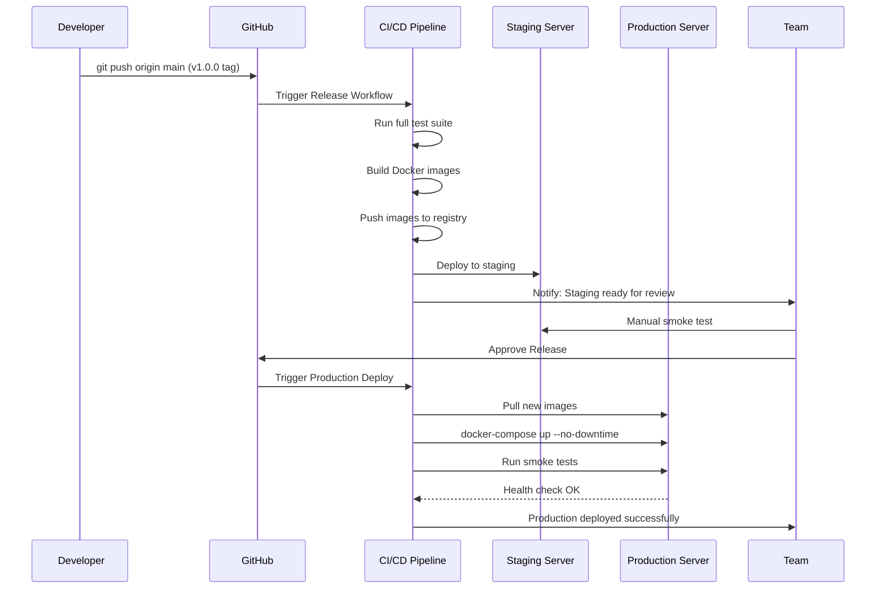

---

## 10. Phase 8 — Maintenance

### 10.1 Monitoring & Alerting

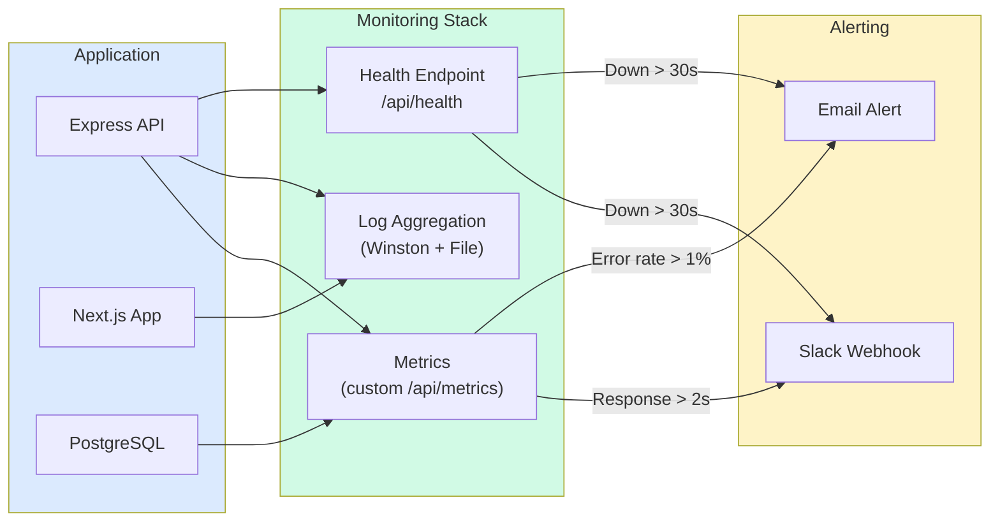

### 10.2 Bug Fix Workflow

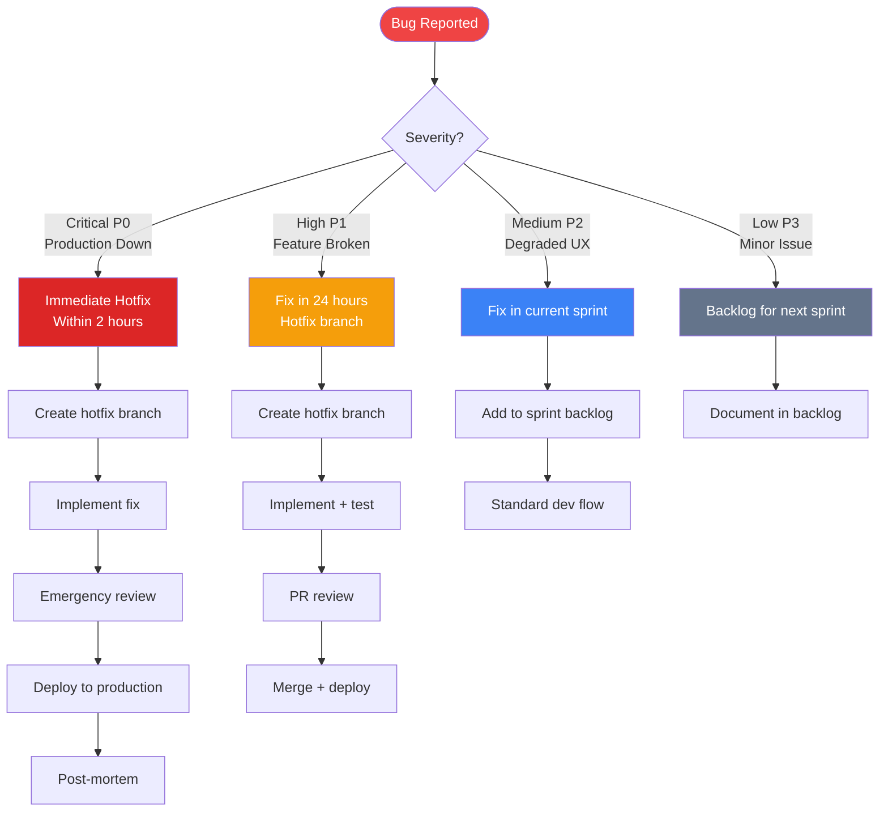

---

## 11. Risk Register

| ID | Risk | Probability | Impact | Mitigation |
|---|---|---|---|---|
| R1 | Sperto API unavailable | Medium | High | Implement retry + circuit breaker, cache last response |
| R2 | PostgreSQL data loss | Low | Critical | Daily automated backups, WAL archiving |
| R3 | JWT secret compromise | Low | Critical | Rotate secrets, use refresh token rotation |
| R4 | Scope creep | High | Medium | Strict MoSCoW prioritization, sprint goals locked |
| R5 | Team member unavailable | Medium | High | Document everything, shared code ownership |
| R6 | Sperto API rate limiting | Low | Medium | Throttle our proxy layer, queue requests |
| R7 | Large data set performance | Medium | Medium | DB indexing, pagination, query optimization |

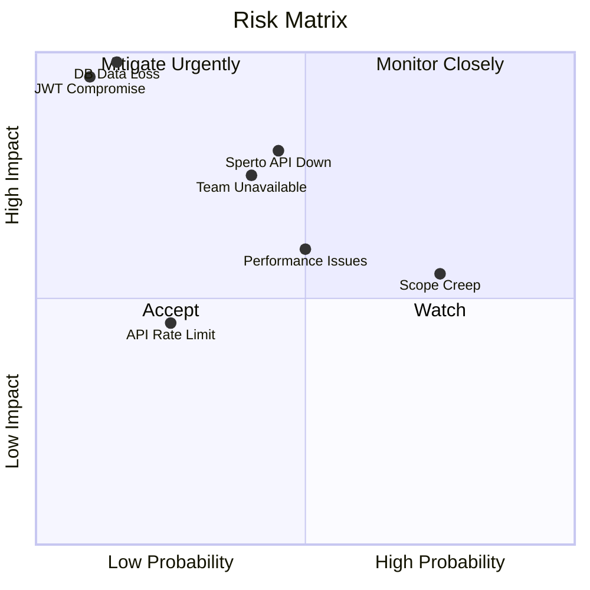

---

## 12. Team & Responsibilities

### RACI Matrix

| Task | Gautam | Yogesh |
|---|---|---|
| Database Schema | C | **R** |
| Backend APIs | C | **R** |
| Sperto Integration | C | **R** |
| Security Hardening | C | **R** |
| Docker + Deployment | C | **R** |
| Design System | **R** | C |
| Frontend Pages | **R** | C |
| State Management | **R** | C |
| Charts & Analytics UI | **R** | C |
| Authentication UI | **R** | C |
| Testing (shared) | **R** | **R** |
| Documentation | **R** | **R** |

> **R** = Responsible · **C** = Consulted

---

*Document maintained by Gautam & Yogesh · Last updated: June 30, 2026*
