# TRD — Technical Requirements Document
## Sperto Dashboard & API Integration System

> **Document Version**: 1.0.0 
> **Date**: June 30, 2026 
> **Technical Lead**: Gautam (Frontend) · Yogesh (Backend) 
> **Status**: Draft 
> **Classification**: Internal · Confidential

---

## Table of Contents

1. [Technology Stack](#1-technology-stack)
2. [System Architecture](#2-system-architecture)
3. [Database Design](#3-database-design)
4. [Authentication Architecture](#4-authentication-architecture)
5. [API Contract](#5-api-contract)
6. [Sperto API Integration](#6-sperto-api-integration)
7. [Frontend Architecture](#7-frontend-architecture)
8. [State Management](#8-state-management)
9. [Security Architecture](#9-security-architecture)
10. [Real-Time Communication](#10-real-time-communication)
11. [Error Handling Strategy](#11-error-handling-strategy)
12. [Performance Requirements](#12-performance-requirements)
13. [Infrastructure & Deployment](#13-infrastructure--deployment)
14. [Logging & Monitoring](#14-logging--monitoring)
15. [Testing Requirements](#15-testing-requirements)

---

## 1. Technology Stack

### 1.1 Full Stack Decision Table

| Layer | Technology | Version | Justification |
|---|---|---|---|
| **Frontend Framework** | Next.js | 15.x | App Router, SSR, file-based routing, Vercel-optimized |
| **Frontend Language** | TypeScript | 5.x | End-to-end type safety, better DX |
| **Styling** | Tailwind CSS | 3.x | Utility-first, design tokens, purge unused styles |
| **UI Component Library** | shadcn/ui | Latest | Accessible, unstyled base, full code ownership |
| **Server State** | TanStack Query | 5.x | Caching, auto-refresh, background sync, optimistic updates |
| **Client State** | Zustand | 4.x | Minimal boilerplate, TypeScript-first, devtools |
| **Forms** | React Hook Form | 7.x | Uncontrolled, performant, works with Zod |
| **Validation (FE)** | Zod | 3.x | Runtime + compile-time schema validation |
| **Animations** | Framer Motion | 11.x | Production-grade React animations |
| **Charts** | Recharts | 2.x | React-native, composable, SVG-based |
| **HTTP Client** | Axios | 1.x | Interceptors, error handling, request/response transform |
| **Backend Framework** | Express.js | 4.x | Lightweight, middleware-rich, vast ecosystem |
| **Backend Language** | TypeScript | 5.x | Consistent with frontend types |
| **ORM** | Prisma | 5.x | Type-safe queries, auto-migrations, studio UI |
| **Database** | PostgreSQL | 16.x | ACID, JSON support, robust, production-proven |
| **Cache / Rate Limit** | Redis | 7.x | Fast in-memory, rate limit store |
| **Authentication** | JWT (jsonwebtoken) | 9.x | Stateless, widely supported |
| **Password Hashing** | bcrypt | 5.x | Industry standard, configurable rounds |
| **Validation (BE)** | Zod | 3.x | Consistent with frontend |
| **Logging** | Winston | 3.x | Structured JSON logs, multiple transports |
| **HTTP Security** | Helmet.js | 7.x | 15+ security headers in one package |
| **Rate Limiting** | express-rate-limit | 7.x | Simple, Redis-backed |
| **PDF Export** | PDFKit | 0.15.x | Node.js PDF generation |
| **Excel Export** | ExcelJS | 4.x | Full Excel support from Node.js |
| **Real-Time** | Server-Sent Events | Native | One-way server push, no WS overhead |
| **Containerization** | Docker + Docker Compose | Latest | Reproducible environments |
| **Reverse Proxy** | Nginx | 1.25.x | SSL termination, routing, static files |
| **Testing (Unit)** | Jest + Testing Library | Latest | Industry standard |
| **Testing (E2E)** | Playwright | 1.x | Cross-browser, reliable, fast |

### 1.2 Technology Dependency Graph

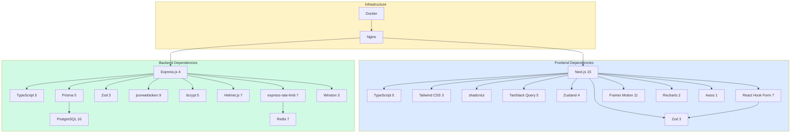

---

## 2. System Architecture

### 2.1 Request Lifecycle

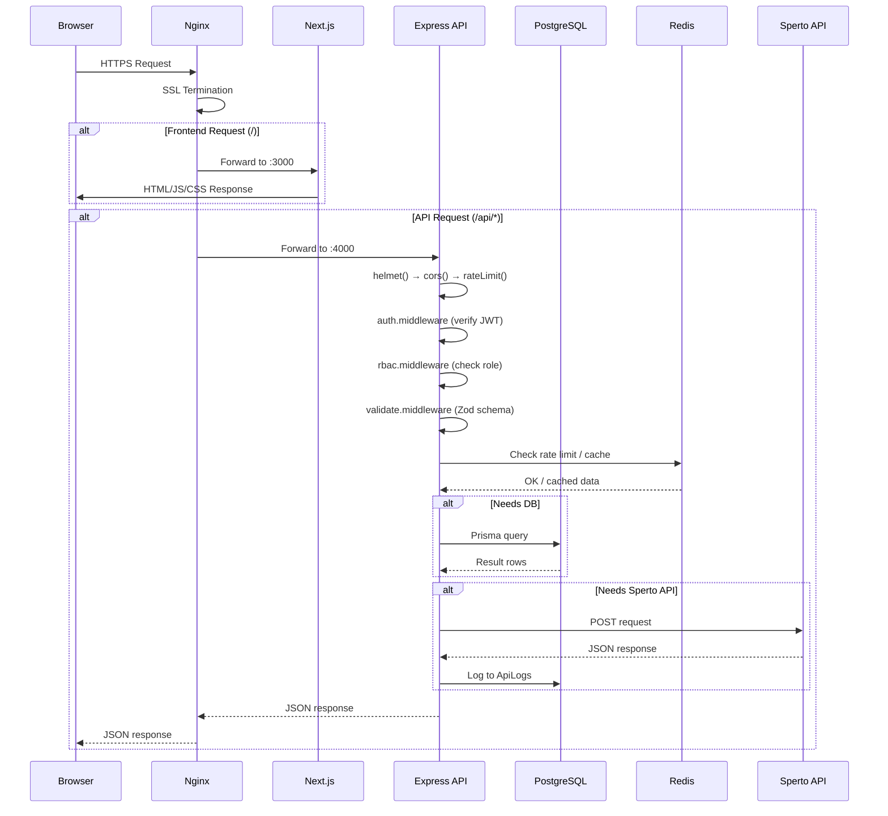

### 2.2 Microservice-Ready Modular Architecture

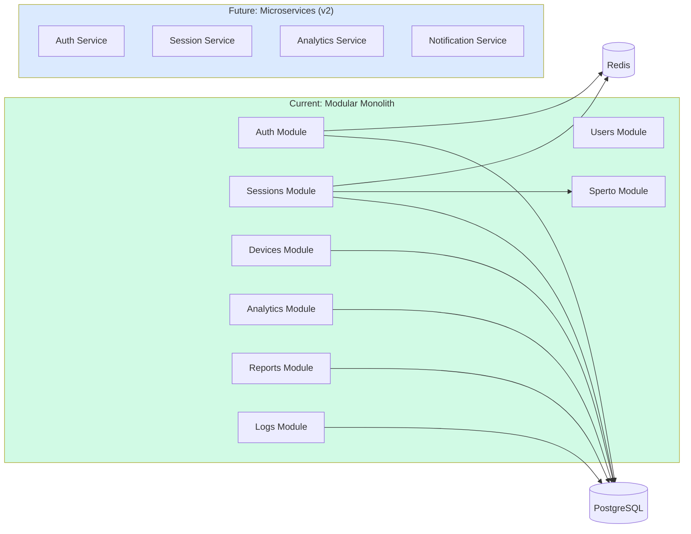

---

## 3. Database Design

### 3.1 Complete Prisma Schema

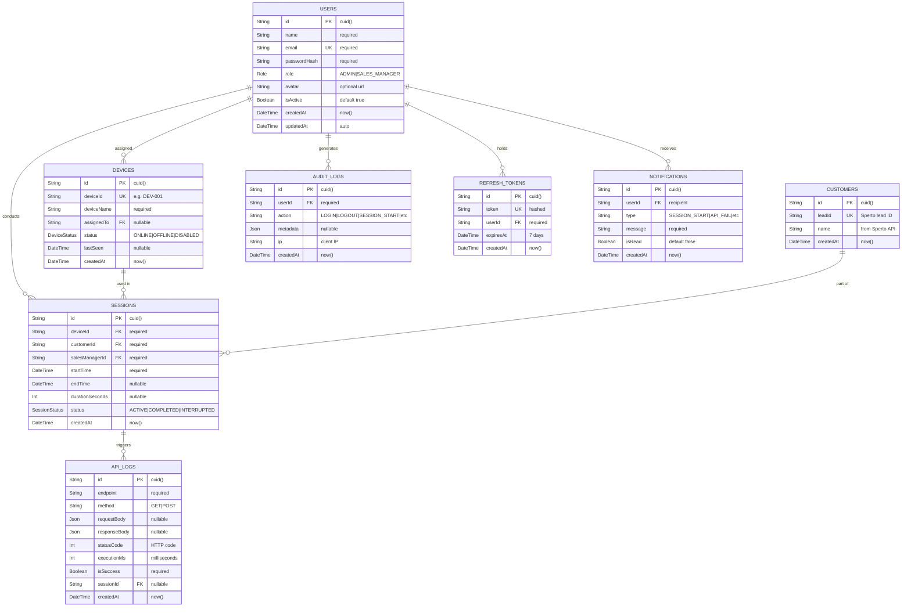

### 3.2 Database Indexes

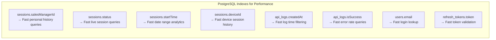

---

## 4. Authentication Architecture

### 4.1 Login Flow

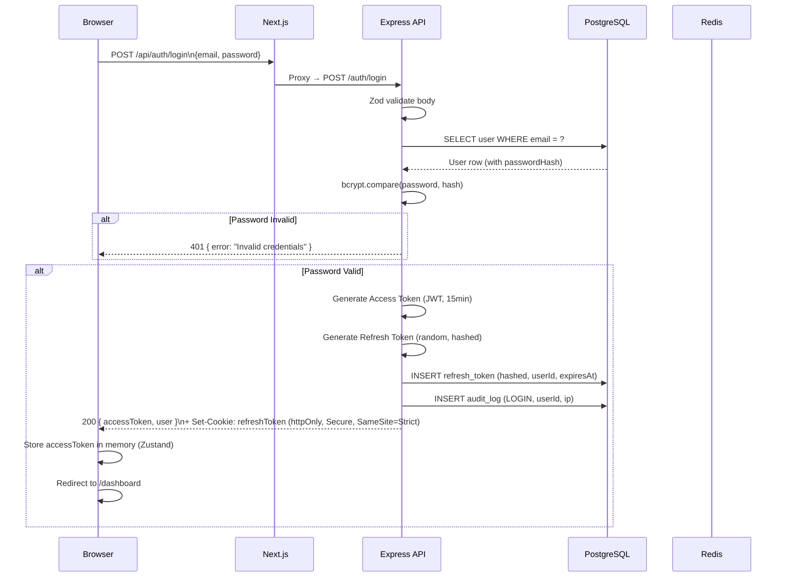

### 4.2 Token Refresh Flow

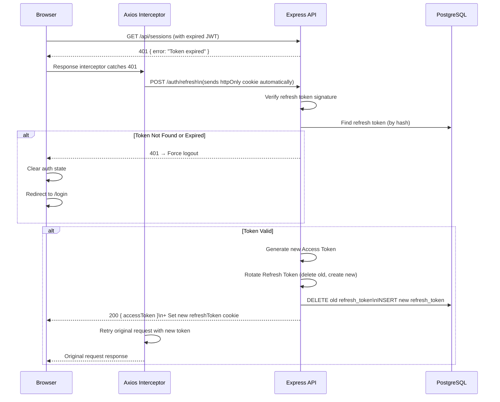

### 4.3 Password Reset Flow

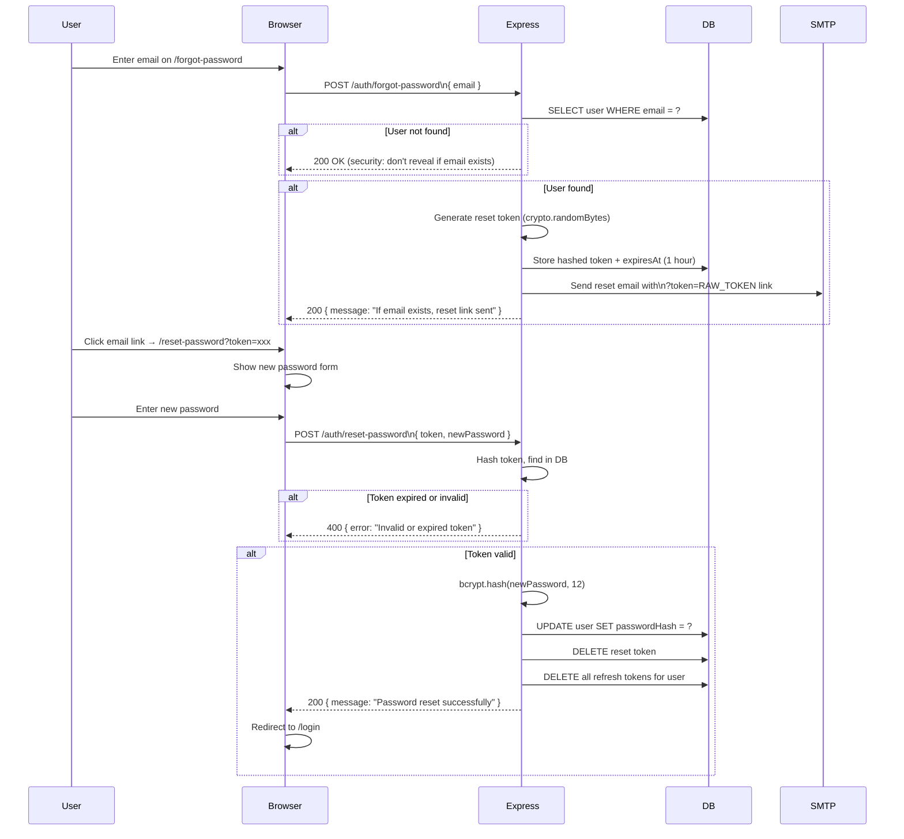

---

## 5. API Contract

### 5.1 Standard Response Format

All API responses follow this structure:

```typescript
// Success Response
{
 "success": true,
 "data": { ... },
 "meta": { // optional, for paginated responses
 "page": 1,
 "limit": 20,
 "total": 150,
 "totalPages": 8
 }
}

// Error Response
{
 "success": false,
 "error": {
 "code": "VALIDATION_ERROR",
 "message": "Human-readable message",
 "details": [ ... ] // optional Zod errors
 }
}
```

### 5.2 Complete API Endpoint Map

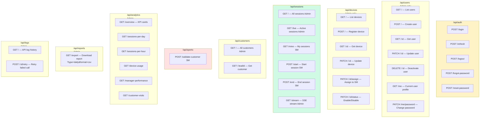

### 5.3 Key API Request/Response Schemas

#### POST /api/auth/login
```typescript
// Request
{ email: string; password: string }

// Response 200
{
 success: true,
 data: {
 accessToken: string,
 user: { id, name, email, role, avatar }
 }
}
```

#### POST /api/sessions/start
```typescript
// Request (Sales Manager only)
{ customerId: string; leadId: string }

// Response 200
{
 success: true,
 data: {
 sessionId: string,
 startTime: string, // ISO 8601
 customerName: string,
 deviceId: string,
 salesManagerEmail: string
 }
}
```

#### POST /api/sessions/end
```typescript
// Request
{ sessionId: string }

// Response 200
{
 success: true,
 data: {
 sessionId: string,
 startTime: string,
 endTime: string,
 durationSeconds: number,
 durationFormatted: string, // "12m 34s"
 status: "COMPLETED"
 }
}
```

#### GET /api/analytics/overview
```typescript
// Response 200
{
 success: true,
 data: {
 todaySessions: number,
 activeSessions: number,
 devicesOnline: number,
 totalDevices: number,
 totalCustomers: number,
 totalSalesManagers: number,
 avgSessionSeconds: number,
 longestSessionSeconds: number,
 shortestSessionSeconds: number
 }
}
```

---

## 6. Sperto API Integration

### 6.1 Integration Architecture

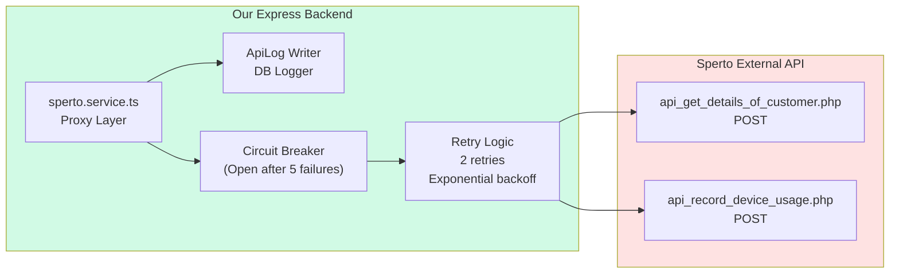

### 6.2 Validate Customer — Integration Flow

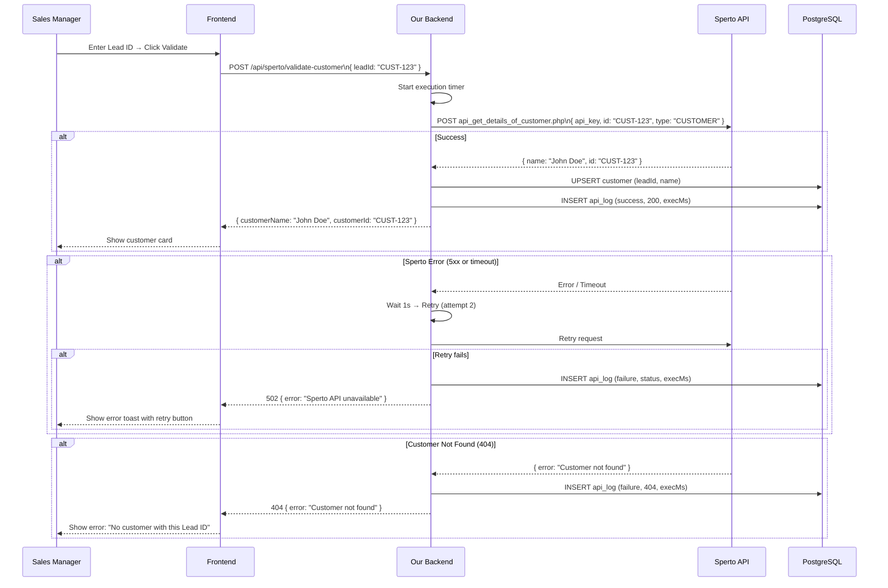

### 6.3 Session Start (IN) — Integration Flow

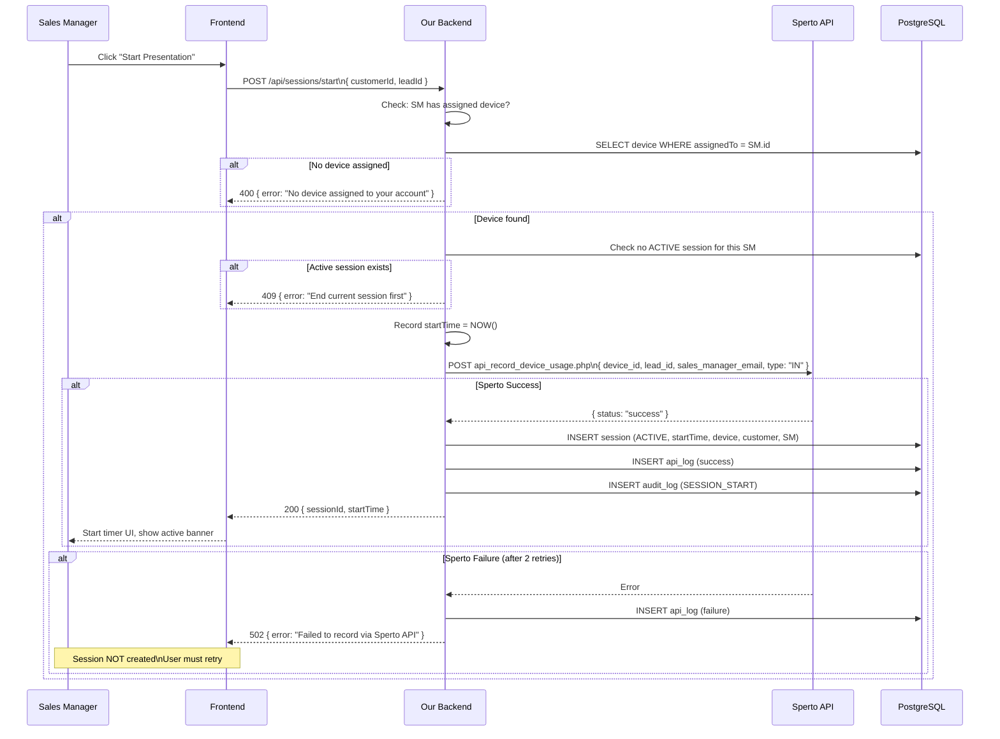

### 6.4 Session End (OUT) — Integration Flow

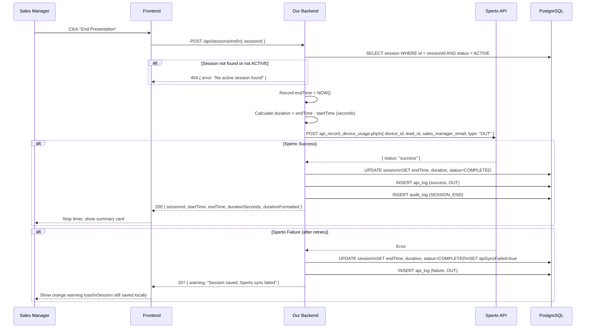

---

## 7. Frontend Architecture

### 7.1 Next.js App Router Structure

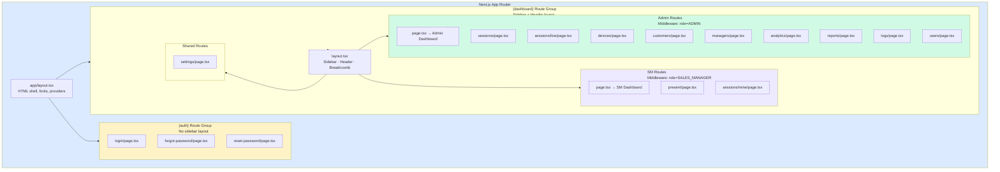

### 7.2 Component Hierarchy

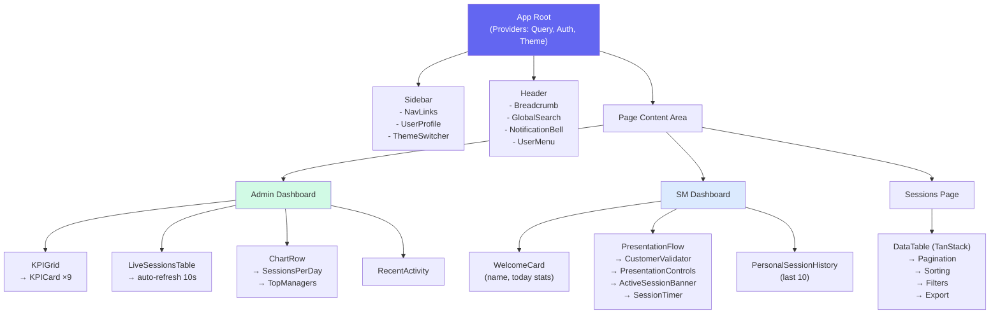

### 7.3 Axios Interceptor Chain

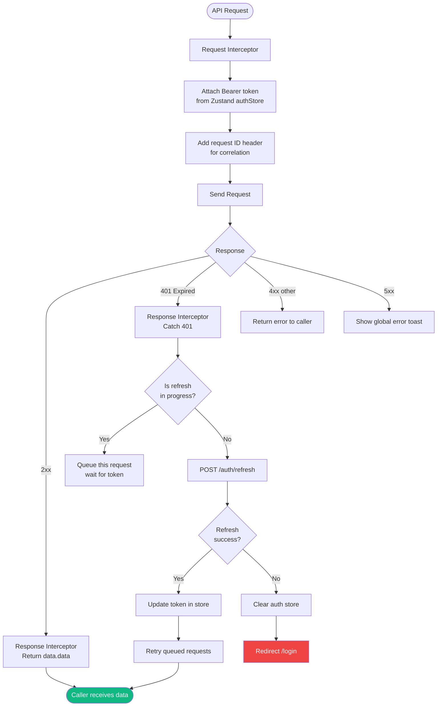

---

## 8. State Management

### 8.1 Zustand Store Architecture

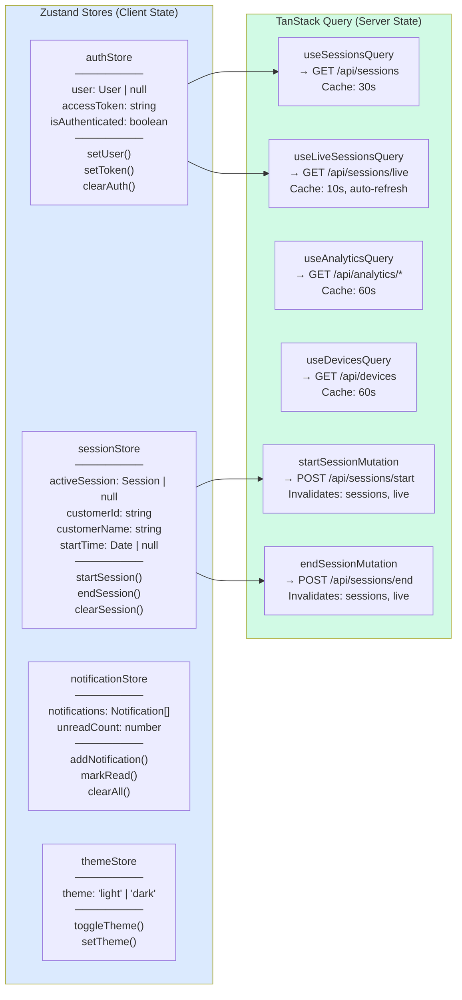

---

## 9. Security Architecture

### 9.1 Security Layers

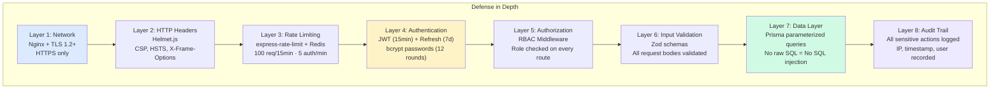

### 9.2 JWT Token Strategy

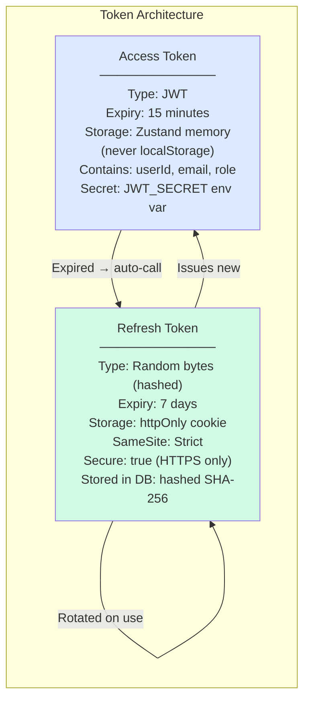

---

## 10. Real-Time Communication

### 10.1 Server-Sent Events Flow

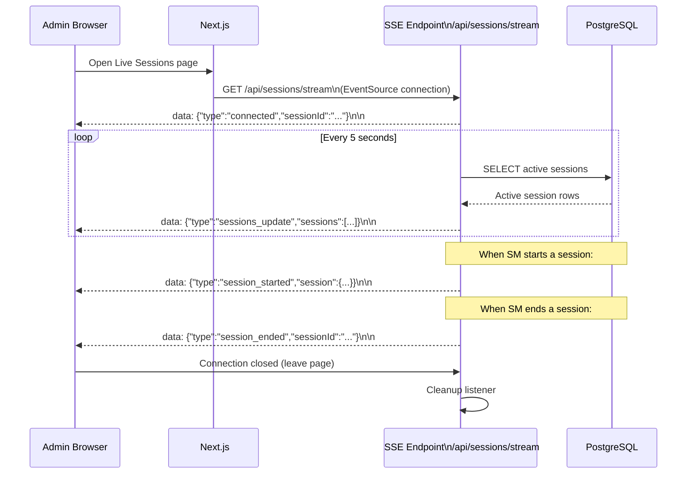

---

## 11. Error Handling Strategy

### 11.1 Error Classification

```mermaid
graph TD
 Error([ Error Occurs]) --> Type{Error Type}

 Type -->|Validation| V["400 Bad Request\nReturn Zod field errors\nto client"]
 Type -->|Auth Failed| A["401 Unauthorized\nClear tokens\nRedirect to login"]
 Type -->|Forbidden| F["403 Forbidden\nReturn: Access denied\nLog attempt"]
 Type -->|Not Found| NF["404 Not Found\nReturn: Resource not found"]
 Type -->|Conflict| C["409 Conflict\nReturn: Duplicate or conflict\n(e.g., active session exists)"]
 Type -->|Sperto API| SP["502 Bad Gateway\nReturn: External API error\nLog to ApiLogs\nRetry if applicable"]
 Type -->|Rate Limited| RL["429 Too Many Requests\nReturn: Retry-After header"]
 Type -->|Server Error| SE["500 Internal Server Error\nLog full stack trace\nReturn: Generic error message\n(never expose internals)"]

 style Error fill:#ef4444,color:#fff
 style V fill:#f59e0b,color:#fff
 style A fill:#ef4444,color:#fff
 style SE fill:#dc2626,color:#fff
 style SP fill:#8b5cf6,color:#fff
```

### 11.2 Frontend Error Boundaries

```mermaid
graph TD
 App["App Root"] --> GlobalEB["Global Error Boundary\n(Catch all unhandled React errors)"]
 GlobalEB --> Dashboard["Dashboard Layout"]
 Dashboard --> ChartEB["Chart Error Boundary\n(Chart render failures → fallback UI)"]
 Dashboard --> TableEB["Table Error Boundary\n(Data fetch failure → empty state)"]
 Dashboard --> FormEB["Form Error Boundary\n(Form submission errors → toast)"]
 
 ChartEB -->|"Error"| ChartFallback[" Chart unavailable\nRetry button"]
 TableEB -->|"Error"| TableFallback[" Failed to load data\nRetry button"]
 GlobalEB -->|"Error"| GlobalFallback[" Something went wrong\nRefresh page button"]

 style GlobalFallback fill:#ef4444,color:#fff
 style ChartFallback fill:#f59e0b,color:#fff
 style TableFallback fill:#f59e0b,color:#fff
```

---

## 12. Performance Requirements

### 12.1 Frontend Performance Budget

| Metric | Target | Measurement |
|---|---|---|
| First Contentful Paint (FCP) | < 1.5s | Lighthouse |
| Largest Contentful Paint (LCP) | < 2.0s | Lighthouse |
| Cumulative Layout Shift (CLS) | < 0.1 | Lighthouse |
| Time to Interactive (TTI) | < 3.0s | Lighthouse |
| Lighthouse Performance Score | ≥ 85 | Lighthouse |
| JS Bundle Size (gzipped) | < 300KB | Next.js Bundle Analyzer |

### 12.2 Backend Performance Budget

| Metric | Target |
|---|---|
| Auth API response | < 200ms |
| Simple CRUD API | < 100ms |
| Analytics aggregate query | < 500ms |
| Report generation (500 rows) | < 5 seconds |
| Sperto API proxy (incl. external) | < 3 seconds |
| DB query (indexed) | < 50ms |

### 12.3 Optimization Techniques

```mermaid
mindmap
 root((Performance\nOptimizations))
 Frontend
 Next.js Image Optimization
 Dynamic imports for charts
 Skeleton loading states
 TanStack Query caching
 Zustand shallow selectors
 Memoized components
 Virtualized large tables
 Backend
 PostgreSQL indexes
 Query result caching Redis
 Pagination all list endpoints
 Streaming for large exports
 Connection pooling Prisma
 Database
 Index on session.status
 Index on session.startTime
 Index on session.salesManagerId
 Composite indexes analytics
```

---

## 13. Infrastructure & Deployment

### 13.1 Docker Compose Architecture

```mermaid
graph TB
 subgraph DockerCompose["docker-compose.yml"]
 subgraph Network["Network: sperto_net"]
 Nginx["nginx\n:80, :443\nVolume: ./nginx.conf"]
 Web["web (Next.js)\n:3000\nBuild: ./apps/web"]
 API["api (Express)\n:4000\nBuild: ./apps/api"]
 PG["postgres\n:5432\nImage: postgres:16\nVolume: pg_data"]
 Redis["redis\n:6379\nImage: redis:7-alpine\nVolume: redis_data"]
 end
 end

 Internet[" Internet"] --> Nginx
 Nginx -->|"/* "| Web
 Nginx -->|"/api/*"| API
 Web -->|"Server-side fetches"| API
 API --> PG
 API --> Redis

 style DockerCompose fill:#dbeafe
 style Nginx fill:#fef3c7
 style PG fill:#d1fae5
 style Redis fill:#fee2e2
```

### 13.2 Environment Configuration

```mermaid
graph LR
 subgraph EnvFiles[".env Files (gitignored)"]
 Dev[".env.development\nDB_URL=localhost\nNODE_ENV=development\nSPERTO_API_KEY=..."]
 Staging[".env.staging\nDB_URL=staging-db\nNODE_ENV=staging"]
 Prod[".env.production\nDB_URL=prod-db (encrypted)\nNODE_ENV=production\nJWT_SECRET=..."]
 end

 subgraph Required["Required Environment Variables"]
 V1["DATABASE_URL"]
 V2["JWT_SECRET"]
 V3["JWT_REFRESH_SECRET"]
 V4["SPERTO_API_KEY"]
 V5["SPERTO_BASE_URL"]
 V6["NEXT_PUBLIC_API_URL"]
 V7["SMTP_HOST / SMTP_PORT"]
 V8["SMTP_USER / SMTP_PASS"]
 end

 Dev --> Required
 Staging --> Required
 Prod --> Required

 style EnvFiles fill:#fef3c7
 style Required fill:#dbeafe
```

---

## 14. Logging & Monitoring

### 14.1 Log Levels & Structure

```mermaid
graph LR
 subgraph Winston["Winston Logger"]
 ERROR["ERROR\nUnhandled exceptions\nSperto API failures\nDB connection issues"]
 WARN["WARN\nRetry attempts\nRate limit hits\nSlow queries > 1s"]
 INFO["INFO\nSession start/end\nUser login/logout\nAPI calls"]
 DEBUG["DEBUG\nQuery parameters\nRequest payloads\nDev only"]
 end

 subgraph Outputs["Log Outputs"]
 Console["Console\n(colorized in dev)"]
 File["File\nlogs/app.log\n(JSON, rotated daily)"]
 ErrorFile["File\nlogs/error.log\n(errors only)"]
 end

 ERROR --> Console
 ERROR --> File
 ERROR --> ErrorFile
 WARN --> Console
 WARN --> File
 INFO --> Console
 INFO --> File
 DEBUG --> Console

 style ERROR fill:#ef4444,color:#fff
 style WARN fill:#f59e0b,color:#fff
 style INFO fill:#3b82f6,color:#fff
 style DEBUG fill:#64748b,color:#fff
```

### 14.2 Health Check Endpoint

```typescript
// GET /api/health
{
 "status": "ok",
 "timestamp": "2026-06-30T18:00:00Z",
 "services": {
 "database": "connected",
 "redis": "connected",
 "sperto": "reachable"
 },
 "version": "1.0.0",
 "uptime": 86400
}
```

---

## 15. Testing Requirements

### 15.1 Test Plan

```mermaid
graph TD
 subgraph UnitTests["Unit Tests (Jest)"]
 U1["auth.service.ts\n- hashPassword\n- comparePassword\n- generateToken\n- verifyToken"]
 U2["session.service.ts\n- calculateDuration\n- validateActiveSession\n- formatDuration"]
 U3["sperto.service.ts\n- buildRequestPayload\n- parseCustomerResponse\n- handleApiError"]
 U4["React Components\n- LoginForm renders\n- KPICard displays value\n- SessionTimer ticks\n- DataTable pagination"]
 end

 subgraph IntTests["Integration Tests (Supertest)"]
 I1["POST /auth/login\n- valid credentials\n- invalid password\n- missing fields"]
 I2["POST /sessions/start\n- success flow\n- no device assigned\n- active session exists"]
 I3["POST /sessions/end\n- success + duration\n- session not found\n- already ended"]
 I4["GET /analytics/overview\n- admin access\n- SM denied"]
 end

 subgraph E2ETests["E2E Tests (Playwright)"]
 E1["Admin Login → Dashboard\n- See KPI cards\n- See charts"]
 E2["SM Login → Present\n- Enter Lead ID\n- Validate customer\n- Start session\n- Timer running\n- End session\n- See summary"]
 E3["Admin Export\n- Navigate reports\n- Select daily\n- Download CSV"]
 E4["Auth Guard\n- SM can't visit /devices\n- Logout + session expire"]
 end

 UnitTests --> IntTests --> E2ETests

 style UnitTests fill:#d1fae5
 style IntTests fill:#dbeafe
 style E2ETests fill:#fef3c7
```

### 15.2 Coverage Requirements

| Module | Unit Coverage | Integration |
|---|---|---|
| Auth service | ≥ 90% | All endpoints |
| Session service | ≥ 85% | All endpoints |
| Sperto service | ≥ 85% | Mocked external |
| Analytics service | ≥ 70% | Key queries |
| React components | ≥ 70% | Key flows |
| **Overall** | **≥ 80%** | **All critical paths** |

---

*Document maintained by Gautam & Yogesh · Version 1.0.0 · June 30, 2026*
