# User Flow & Workflow Diagrams
## Sperto Dashboard & API Integration System

> **Document Version**: 1.0.0 
> **Date**: June 30, 2026 
> **Team**: Gautam · Yogesh 
> **Classification**: Internal · Confidential

---

## Table of Contents

1. [Sitemap](#1-sitemap)
2. [Information Architecture](#2-information-architecture)
3. [Authentication Flows](#3-authentication-flows)
4. [RBAC Routing Logic](#4-rbac-routing-logic)
5. [Admin Workflows](#5-admin-workflows)
6. [Sales Manager Workflows](#6-sales-manager-workflows)
7. [Notification Flow](#7-notification-flow)
8. [Data Export Flow](#8-data-export-flow)
9. [Real-Time Session Monitoring Flow](#9-real-time-session-monitoring-flow)
10. [Settings & Profile Flow](#10-settings--profile-flow)

---

## 1. Sitemap

```mermaid
graph TD
 Root[" / — Root"] --> Login["/login"]
 Root --> Forgot["/forgot-password"]
 Root --> Reset["/reset-password"]
 Root --> Dashboard["/dashboard — Main Entry"]

 Dashboard --> AdminGroup[" Admin Pages"]
 Dashboard --> SMGroup[" Sales Manager Pages"]
 Dashboard --> Shared[" Shared Pages"]

 AdminGroup --> A1["/dashboard\n(Admin Overview)"]
 AdminGroup --> A2["/sessions\n(All Sessions)"]
 AdminGroup --> A3["/sessions/live\n(Live Monitor)"]
 AdminGroup --> A4["/devices\n(Device Management)"]
 AdminGroup --> A5["/customers\n(Customer List)"]
 AdminGroup --> A6["/managers\n(Sales Manager List)"]
 AdminGroup --> A7["/analytics\n(Charts & Insights)"]
 AdminGroup --> A8["/reports\n(Report Generator)"]
 AdminGroup --> A9["/logs\n(API Log Monitor)"]
 AdminGroup --> A10["/users\n(User Management)"]

 SMGroup --> S1["/dashboard\n(SM Personal Home)"]
 SMGroup --> S2["/present\n(Presentation Flow)"]
 SMGroup --> S3["/sessions/mine\n(Personal History)"]

 Shared --> SH1["/settings\n(Profile & Preferences)"]
 Shared --> SH2["/settings/password\n(Change Password)"]

 style Root fill:#6366f1,color:#fff
 style AdminGroup fill:#d1fae5
 style SMGroup fill:#dbeafe
 style Shared fill:#fef3c7
```

---

## 2. Information Architecture

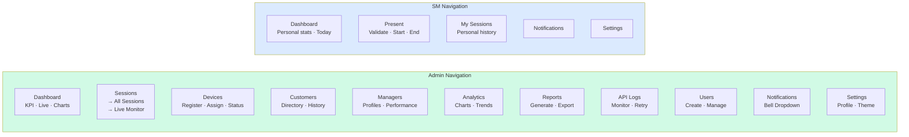

---

## 3. Authentication Flows

### 3.1 Login Flow

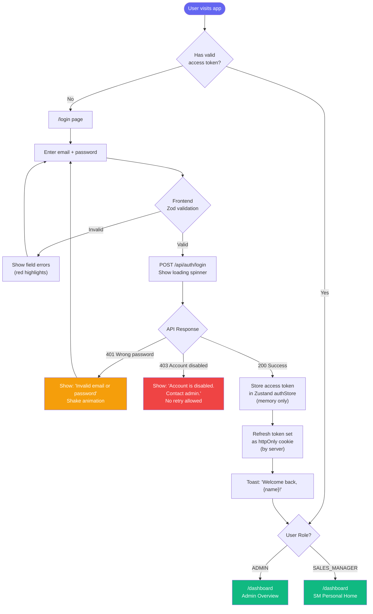

### 3.2 Forgot Password Flow

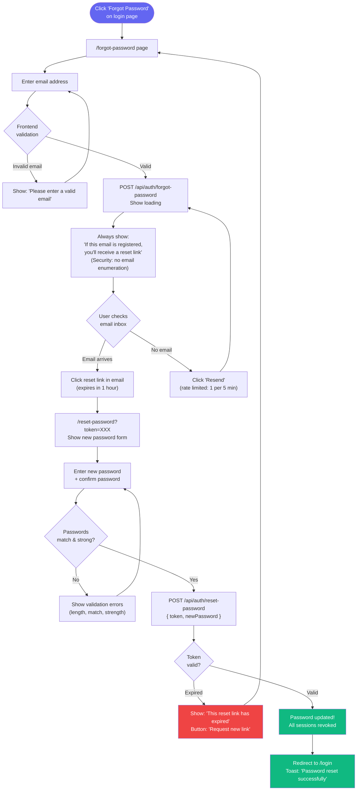

### 3.3 Session Timeout & Auto-Refresh Flow

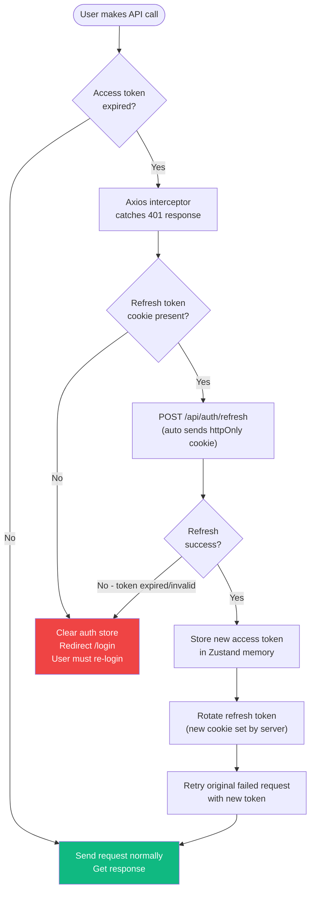

### 3.4 Logout Flow

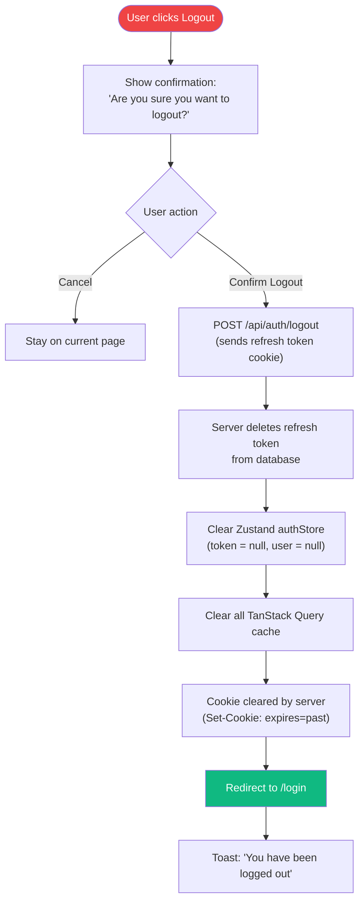

---

## 4. RBAC Routing Logic

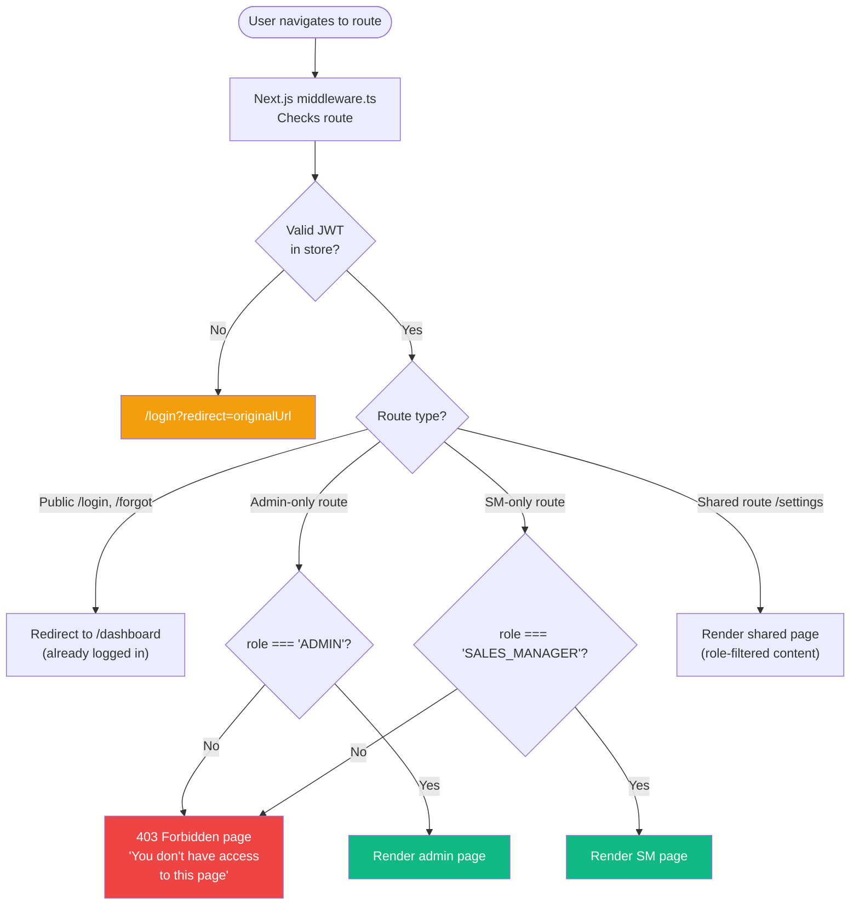

---

## 5. Admin Workflows

### 5.1 Admin Dashboard Overview Flow

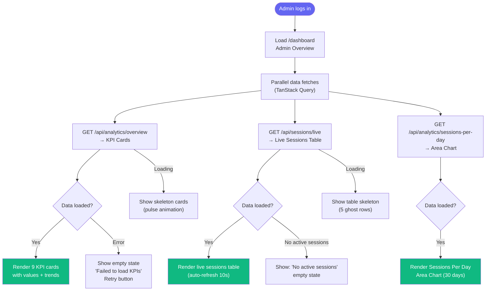

### 5.2 Device Registration Flow

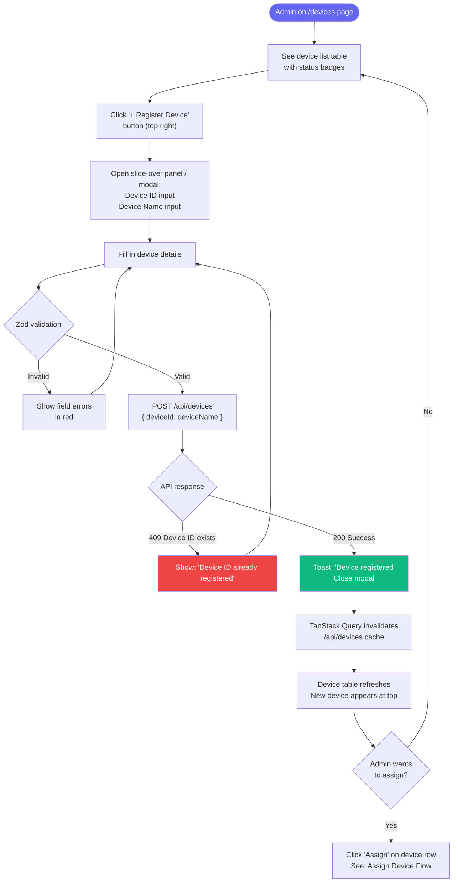

### 5.3 Assign Device to Sales Manager Flow

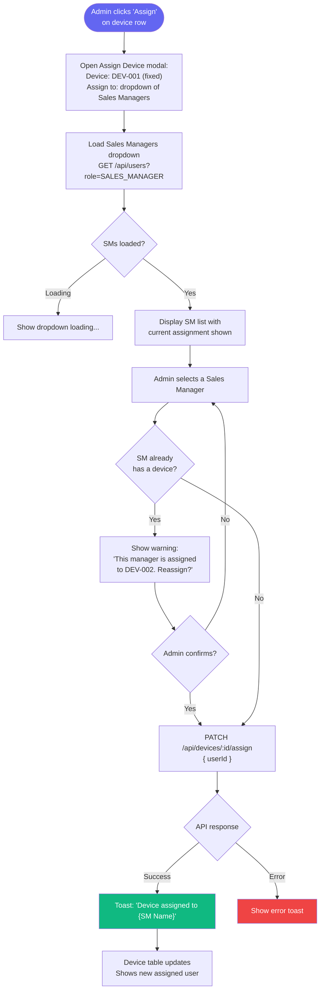

### 5.4 Live Sessions Monitor Flow

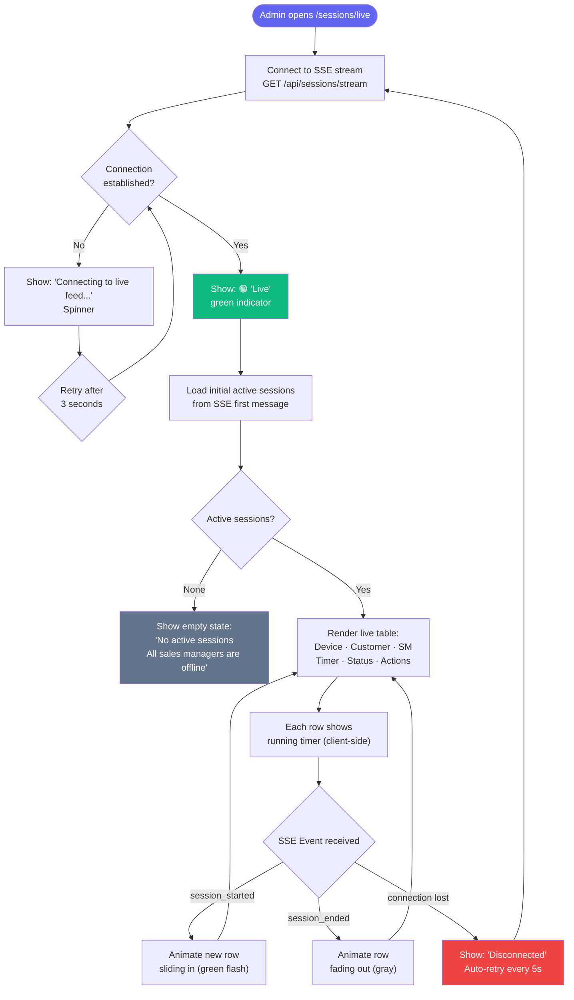

### 5.5 Session History & Filters Flow

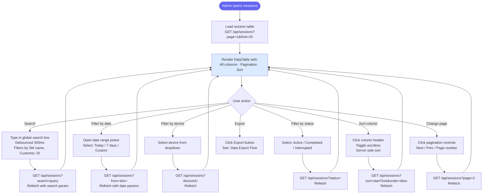

### 5.6 User Management Flow (Admin)

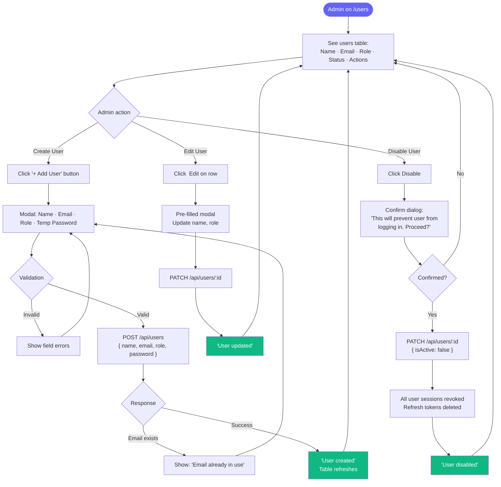

### 5.7 Analytics Dashboard Flow

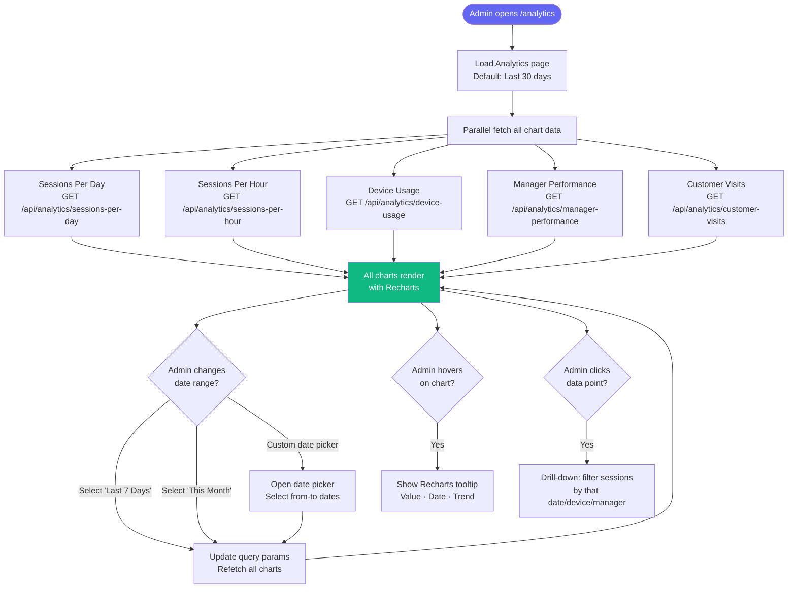

### 5.8 API Logs Monitor Flow

```mermaid
flowchart TD
 A([Admin opens /logs]) --> B["Load API logs table\nGET /api/logs?page=1\nMost recent first"]
 B --> C["Render log table:\nEndpoint · Status · Time · Timestamp"]
 
 C --> D{Admin action}
 
 D -->|View log detail| E["Click row to expand\nShow: Request payload\nResponse payload\nExecution time\nTimestamp"]
 
 D -->|Filter by success| F["Click 'Success / Failed' toggle"]
 F --> G["GET /api/logs?success=false\nShow only failed calls"]
 G --> C
 
 D -->|Search endpoint| H["Type endpoint in search\nFilter: /api_record_device_usage"]
 H --> C
 
 D -->|Retry failed call| I{Is call\nretriable?}
 I -->|No (read-only)| J["Retry button disabled\n(grey, tooltip: 'Read-only calls\ncannot be retried')"]
 I -->|Yes (state-change)| K["Click ' Retry' button"]
 K --> L["Show: 'Are you sure you want\nto retry this API call?'\nConfirm dialog"]
 L --> M{Confirmed?}
 M -->|No| C
 M -->|Yes| N["POST /api/logs/:id/retry"]
 N --> O{Retry result}
 O -->|Success| P[" 'Retry successful'\nNew log entry created\nOld marked: 'Retried'"]
 O -->|Failure| Q[" 'Retry failed again'\nNew error log entry"]
 P & Q --> C

 style A fill:#6366f1,color:#fff
 style P fill:#10b981,color:#fff
 style Q fill:#ef4444,color:#fff
```

---

## 6. Sales Manager Workflows

### 6.1 SM Dashboard Home Flow

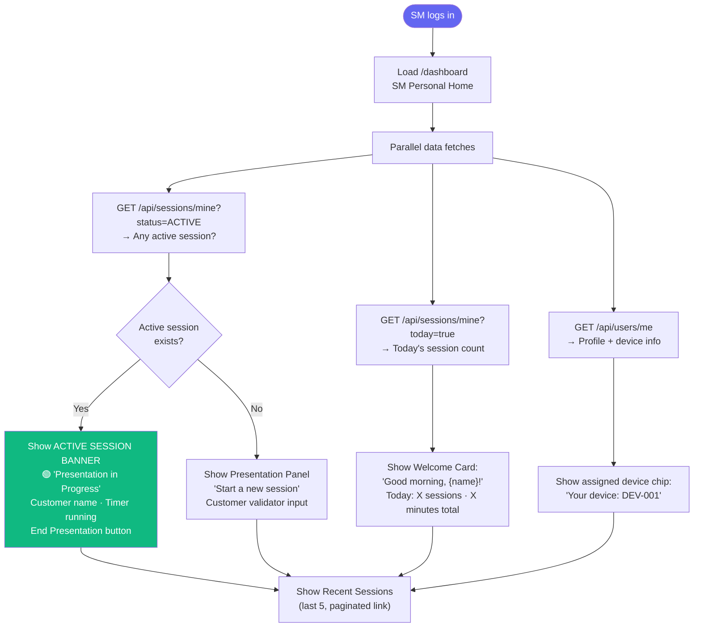

### 6.2 Complete Sales Manager Session Workflow

```mermaid
flowchart TD
 A([SM on /present page]) --> B{Existing active\nsession?}
 
 B -->|Yes| ACTIVE["Show active session UI:\n🟢 Session in progress\nCustomer: {name}\nTimer: 00:12:34\nEnd Presentation button"]
 
 B -->|No| STEP1["STEP 1: Enter Lead ID\nInput field with placeholder\n'Enter Customer Lead ID'"]
 
 STEP1 --> STEP2["STEP 2: Click 'Validate Customer'"]
 STEP2 --> VAL{Valid Lead ID?}
 VAL -->|Empty/invalid format| ERR1["Show: 'Please enter a valid Lead ID'\n(field goes red)"]
 ERR1 --> STEP1
 VAL -->|Valid format| APICALL1["POST /api/sperto/validate-customer\n{ leadId }\nShow spinner on button"]
 
 APICALL1 --> VALRES{Sperto API\nResponse}
 VALRES -->|Customer found| STEP3["STEP 3: Show Customer Card\n──────────────────\n John Doe\nLead ID: CUST-123\n──────────────────\nConfirm button appears"]
 VALRES -->|Not found| ERR2[" 'No customer found with\nthis Lead ID'\nClear form, retry"]
 VALRES -->|API error| ERR3["🟡 'Unable to verify customer.\nCheck connection and retry.'"]
 
 ERR2 --> STEP1
 ERR3 --> STEP1
 
 STEP3 --> STEP4["STEP 4: Click 'Start Presentation'\n(now enabled, green button)"]
 STEP4 --> CONFIRM["Confirmation modal:\n'Start session with John Doe?\nDevice: DEV-001'\nConfirm · Cancel"]
 CONFIRM --> CONFRES{SM confirms?}
 CONFRES -->|Cancel| STEP3
 CONFRES -->|Confirm| APICALL2["POST /api/sessions/start\n{ customerId, leadId }\nShow spinner"]
 
 APICALL2 --> STARTRES{Session start\nresult}
 STARTRES -->|Success| STEP5["STEP 5: SESSION ACTIVE\n────────────────────────\n🟢 Presentation in Progress\nCustomer: John Doe\nStarted: 2:30 PM\nTimer: 00:00:01 → (counting)\n────────────────────────\nEnd Presentation button\n(red, prominent)"]
 STARTRES -->|No device assigned| ERR4[" 'No device assigned to\nyour account.\nContact admin.'"]
 STARTRES -->|API error| ERR5[" 'Failed to start session.\nSperto API error. Try again.'"]
 
 STEP5 --> ACTIVE
 ACTIVE --> STEP6["STEP 6: SM presents\nPDF / Brochure / Catalog\n(external software, we just track time)"]
 
 STEP6 --> STEP7["STEP 7: Click 'End Presentation'\n(SM is done with customer)"]
 STEP7 --> ENDCONFIRM["End Presentation modal:\n'Session Summary So Far:\nCustomer: John Doe\nDuration: 00:23:45'\nEnd Now · Continue"]
 ENDCONFIRM --> ENDRES{SM decides}
 ENDRES -->|Continue| STEP6
 ENDRES -->|End Now| APICALL3["POST /api/sessions/end\n{ sessionId }\nShow spinner"]
 
 APICALL3 --> ENDAPIRES{End session\nresult}
 ENDAPIRES -->|Success| STEP8["STEP 8: Session Summary Card\n────────────────────────\n Presentation Complete\nCustomer: John Doe\nStarted: 2:30 PM\nEnded: 2:54 PM\nDuration: 23 minutes 45 seconds\n────────────────────────\nStart New Session button"]
 ENDAPIRES -->|Sperto failed but saved| WARN["🟡 Warning: Session saved\nbut Sperto sync failed.\nAdmin has been notified."]
 WARN --> STEP8
 STEP8 --> B

 style A fill:#6366f1,color:#fff
 style STEP5 fill:#10b981,color:#fff
 style STEP8 fill:#10b981,color:#fff
 style ERR1 fill:#ef4444,color:#fff
 style ERR2 fill:#ef4444,color:#fff
 style ERR3 fill:#f59e0b,color:#fff
 style ERR4 fill:#ef4444,color:#fff
 style ERR5 fill:#ef4444,color:#fff
 style WARN fill:#f59e0b,color:#fff
```

### 6.3 SM Session History Flow

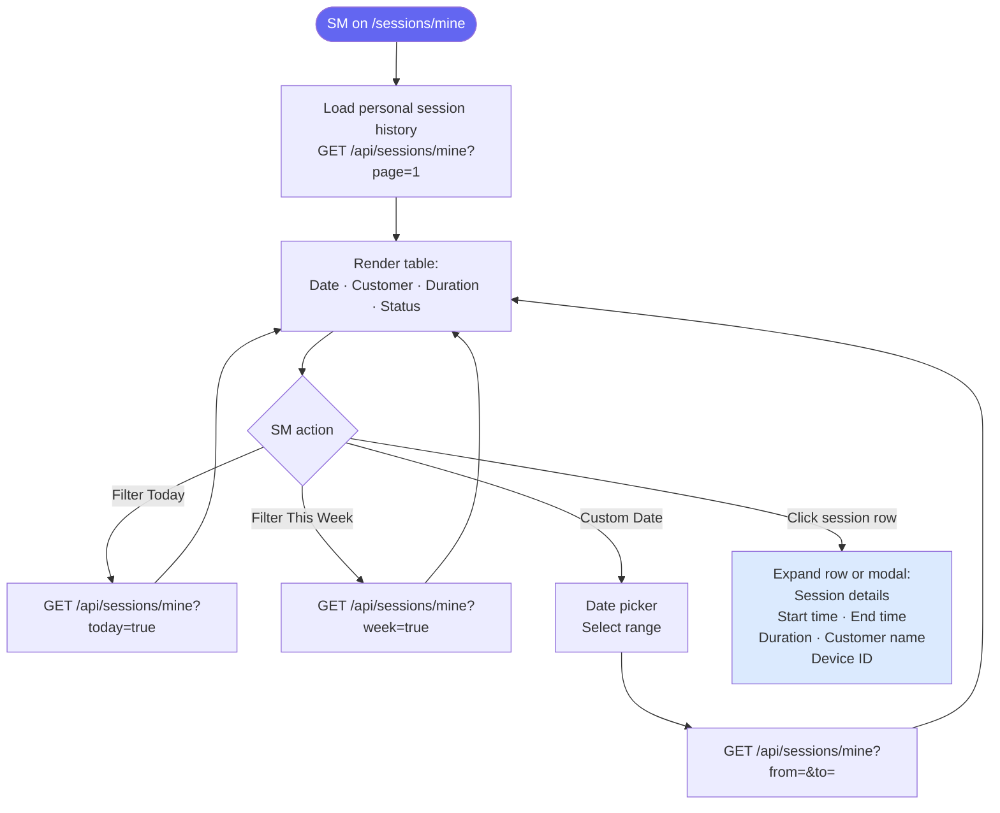

### 6.4 SM Personal Analytics Flow

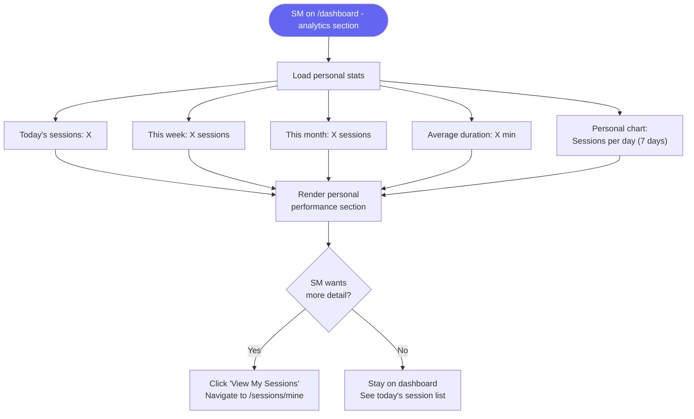

---

## 7. Notification Flow

### 7.1 Notification Generation & Display Flow

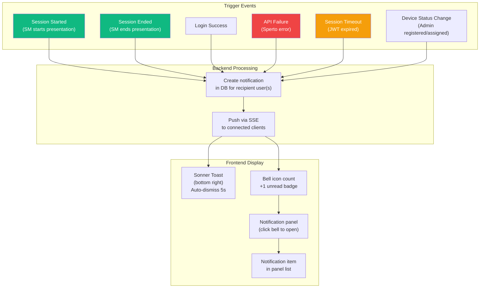

### 7.2 Notification Panel Interaction Flow

```mermaid
flowchart TD
 A([User sees with badge]) --> B["Click bell icon"]
 B --> C["Slide-in notification panel\nLoad GET /api/notifications\nShow unread at top"]
 C --> D{Notifications?}
 D -->|Empty| E["Show: 'No notifications yet'\nEmpty state illustration"]
 D -->|Has notifications| F["List notifications:\n• 🟢 Session started: John Doe\n• Session ended: 23 min\n• API error: Sperto timeout"]
 F --> G{User clicks\nnotification}
 G -->|Session notification| H["Mark as read\nNavigate to /sessions/live\nor /sessions/mine"]
 G -->|API error notification| I["Mark as read\nNavigate to /logs"]
 G -->|'Mark all read' button| J["PATCH /api/notifications/mark-all-read\nAll badges cleared"]
 H & I & J --> K["Bell badge\ncount updates"]

 style A fill:#6366f1,color:#fff
 style H fill:#10b981,color:#fff
 style I fill:#10b981,color:#fff
```

---

## 8. Data Export Flow

```mermaid
flowchart TD
 A([Admin on /reports page]) --> B["Select report type:\n• Daily Report\n• Weekly Report\n• Monthly Report\n• Device Report\n• Customer Report\n• Sales Manager Report\n• Session Report"]
 B --> C["Select date range\n(pre-filled based on type)"]
 C --> D["Select export format:\n CSV\n Excel (.xlsx)\n PDF"]
 D --> E["Click 'Generate Report'\nShow: 'Preparing report...' spinner"]
 E --> F["GET /api/reports/export\n?type=daily&format=csv&from=&to=\nAuthorization: Bearer token"]
 F --> G{Report size}
 G -->|Small < 500 rows| H["Stream file directly\nContent-Disposition: attachment\nContent-Type: text/csv"]
 G -->|Large > 500 rows| I["Show progress bar\n'Processing 1200 rows...'"]
 I --> H
 H --> J["Browser auto-downloads file\nsperto-daily-2026-06-30.csv"]
 J --> K[" Toast: 'Report downloaded!\n1,234 sessions exported'"]
 
 F --> ERR{Error?}
 ERR -->|No data for range| L["Show: 'No sessions found\nfor selected date range'"]
 ERR -->|Server error| M["Show: ' Export failed.\nPlease try again.'"]

 style A fill:#6366f1,color:#fff
 style K fill:#10b981,color:#fff
 style L fill:#f59e0b,color:#fff
 style M fill:#ef4444,color:#fff
```

---

## 9. Real-Time Session Monitoring Flow

```mermaid
sequenceDiagram
 participant Admin as Admin Browser
 participant SSE as SSE Endpoint
 participant SM1 as Sales Manager 1
 participant SM2 as Sales Manager 2
 participant BE as ️ Backend

 Admin->>SSE: Open /sessions/live page\nConnect EventSource
 SSE-->>Admin: {"type":"connected"}\nInitial sessions snapshot

 Note over Admin,SSE: Admin sees empty live table

 SM1->>BE: POST /sessions/start\n{customer: "Alice", device: "DEV-001"}
 BE-->>SM1: 200 { sessionId }
 BE->>SSE: Emit: session_started event
 SSE-->>Admin: {"type":"session_started",\n"session":{id, customer:"Alice",\nSM:"SM1", device:"DEV-001",\nstartTime, status:"ACTIVE"}}
 
 Note over Admin: New row animates in 🟢
 Note over Admin: Client-side timer starts: 00:00:01...

 SM2->>BE: POST /sessions/start\n{customer: "Bob", device: "DEV-002"}
 BE-->>SM2: 200 { sessionId }
 BE->>SSE: Emit: session_started event
 SSE-->>Admin: {"type":"session_started",\n"session":{...Bob...}}
 Note over Admin: Second row animates in 🟢

 Note over Admin,SSE: Admin now sees 2 active sessions, timers running

 SM1->>BE: POST /sessions/end\n{sessionId}
 BE-->>SM1: 200 { duration: 845 }
 BE->>SSE: Emit: session_ended event
 SSE-->>Admin: {"type":"session_ended",\n"sessionId":"...", "duration":845,\n"status":"COMPLETED"}
 Note over Admin: Alice row fades out \nTimer stops, shows "14m 05s"
```

---

## 10. Settings & Profile Flow

### 10.1 Profile Update Flow

```mermaid
flowchart TD
 A([User on /settings]) --> B["Show profile form:\nName · Email (read-only)\nAvatar upload\nRole (read-only)"]
 B --> C["User edits name / avatar"]
 C --> D{Changed?}
 D -->|No changes| E["Save button disabled\n(grey)"]
 D -->|Changed| F["Save button enabled\n(blue)"]
 F --> G["Click Save"]
 G --> H{Validation}
 H -->|Invalid| I["Show field errors"]
 I --> C
 H -->|Valid| J["PATCH /api/users/me\n{ name, avatar }"]
 J --> K{Response}
 K -->|Success| L[" 'Profile updated'\nUpdate Zustand authStore\nUpdate header avatar"]
 K -->|Error| M[" 'Failed to save. Try again.'"]

 style A fill:#6366f1,color:#fff
 style L fill:#10b981,color:#fff
 style M fill:#ef4444,color:#fff
```

### 10.2 Change Password Flow

```mermaid
flowchart TD
 A([User on /settings/password]) --> B["Show form:\nCurrent Password\nNew Password\nConfirm New Password"]
 B --> C["User fills form"]
 C --> D{Frontend\nvalidation}
 D -->|New passwords don't match| E["Show: 'Passwords do not match'"]
 E --> C
 D -->|New password too weak| F["Show strength meter\n'Password must be 8+ chars\nwith uppercase + number'"]
 F --> C
 D -->|Valid| G["PATCH /api/users/me/password\n{ currentPassword, newPassword }"]
 G --> H{Response}
 H -->|401 Wrong current password| I["Show: 'Current password\nis incorrect'"]
 I --> C
 H -->|200 Success| J[" 'Password changed'\nAll other sessions logged out\n(refresh tokens revoked)"]
 J --> K["Redirect to /login\n'Please log in with\nyour new password'"]

 style A fill:#6366f1,color:#fff
 style J fill:#10b981,color:#fff
 style K fill:#6366f1,color:#fff
```

### 10.3 Theme Switcher Flow

```mermaid
flowchart LR
 A([User clicks Theme Toggle\nin sidebar/header]) --> B{Current theme?}
 B -->|Light| C["Switch to Dark Mode\nUpdate Zustand themeStore\nAdd 'dark' class to html element\nSave to localStorage"]
 B -->|Dark| D["Switch to Light Mode\nUpdate Zustand themeStore\nRemove 'dark' class\nSave to localStorage"]
 C & D --> E["Tailwind dark: variants\napply instantly\nSmooth CSS transition 300ms"]
 E --> F["Theme persists\nacross page refreshes\n(read from localStorage on app init)"]

 style A fill:#6366f1,color:#fff
 style F fill:#10b981,color:#fff
```

---

## Summary: All Workflows at a Glance

| # | Workflow | Actor | Key API Calls | Complexity |
|---|---|---|---|---|
| 1 | Login | All | POST /auth/login | Medium |
| 2 | Forgot Password | All | POST /auth/forgot-password | Medium |
| 3 | Reset Password | All | POST /auth/reset-password | Medium |
| 4 | Token Auto-Refresh | System | POST /auth/refresh | High |
| 5 | Logout | All | POST /auth/logout | Low |
| 6 | RBAC Route Guard | System | Middleware | High |
| 7 | Admin Dashboard Load | Admin | GET /analytics/overview | Medium |
| 8 | Register Device | Admin | POST /devices | Low |
| 9 | Assign Device | Admin | PATCH /devices/:id/assign | Medium |
| 10 | Live Session Monitor | Admin | SSE /sessions/stream | High |
| 11 | Session History + Filters | Admin | GET /sessions | Medium |
| 12 | User Management | Admin | POST/PATCH /users | Medium |
| 13 | Analytics Dashboard | Admin | GET /analytics/* | Medium |
| 14 | API Logs + Retry | Admin | GET /logs · POST /logs/:id/retry | Medium |
| 15 | Customer Validation | Sales Manager | POST /sperto/validate-customer | High |
| 16 | Start Presentation | Sales Manager | POST /sessions/start → Sperto IN | High |
| 17 | End Presentation | Sales Manager | POST /sessions/end → Sperto OUT | High |
| 18 | SM Session History | Sales Manager | GET /sessions/mine | Low |
| 19 | Data Export | Admin | GET /reports/export | Medium |
| 20 | Notifications | All | SSE + /notifications | High |
| 21 | Change Password | All | PATCH /users/me/password | Medium |
| 22 | Profile Update | All | PATCH /users/me | Low |
| 23 | Theme Switch | All | localStorage | Low |

---

*Document maintained by Gautam & Yogesh · Version 1.0.0 · June 30, 2026*
